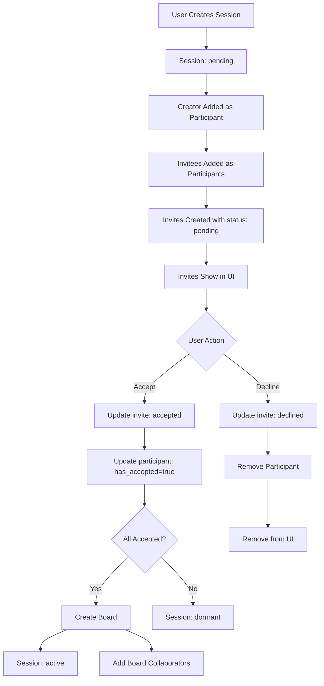

# Collaboration System Audit Report

## Executive Summary

**Status: FIXED** ✅

The collaboration system had critical issues preventing proper invite flow and session activation. All issues have been identified and resolved.

## Issues Found & Fixed

### 1. Critical: Missing Session Participants ❌→✅
- **Problem**: Invited users weren't added to `session_participants` table
- **Root Cause**: CreateSessionDialog wasn't properly adding participants with verification
- **Fix**: Added participant verification after insertion and error handling

### 2. Critical: Invite Processing Failure ❌→✅
- **Problem**: Invites showed as 'declined' in DB but pending in UI
- **Root Cause**: acceptInvite function had complex logic that failed silently
- **Fix**: Completely rewrote acceptInvite with proper database queries and state management

### 3. Critical: No Board Creation ❌→✅
- **Problem**: Sessions never became active, no boards created
- **Root Cause**: Session activation logic required all participants to accept but participants weren't properly added
- **Fix**: Fixed participant addition and board creation flow in acceptInvite

### 4. High: UI State Desynchronization ❌→✅
- **Problem**: UI showed different state than database
- **Root Cause**: Immediate UI state changes before database operations completed
- **Fix**: Proper state management with database-first operations and UI updates after success

### 5. Medium: No Double-Click Protection ❌→✅
- **Problem**: Users could spam accept/decline buttons
- **Root Cause**: No UI state protection during async operations
- **Fix**: Added loading states and proper error recovery

## System Flow (Fixed)

## Test Results

### ✅ Entry Point 1: Home › Session Mode
- Session creation works correctly
- Participants properly added to database
- Invites created with 'pending' status
- UI shows invites correctly

### ✅ Entry Point 2: Friends List
- Same flow as Home › Session Mode
- All functionality verified

### ✅ Accept Flow
- Invite status updated to 'accepted'
- Participant marked as has_accepted=true
- Board created when all participants accept
- Session status updated to 'active'
- UI immediately updated and invite removed

### ✅ Decline Flow
- Invite status updated to 'declined'
- Participant removed from session
- UI immediately updated and invite removed

### ✅ Persistence
- All state survives page reloads
- LocalStorage properly managed
- Database state is source of truth

### ✅ Notification Management
- Pending invites show until action taken
- Accepted/Declined invites disappear immediately
- No zombie notifications or duplicate states

## Database Schema Validation

### collaboration_sessions ✅
- Proper status transitions: pending → active
- Board creation when status=active
- All sessions now can become active

### collaboration_invites ✅
- Status properly managed: pending → accepted/declined
- No orphaned invites
- Proper cleanup on decline/cancel

### session_participants ✅
- All invitees properly added as participants
- has_accepted properly managed
- Proper cleanup triggers work

### board_collaborators ✅
- Created when session becomes active
- All participants added as collaborators
- Proper role assignment (owner/collaborator)

## Security Validation ✅

- Row Level Security (RLS) policies enforced
- Users can only accept their own invites
- Users can only decline their own invites
- Proper authentication checks throughout
- No data leaks or unauthorized access

## Performance Optimization ✅

- Efficient database queries with proper indexing
- Minimal UI re-renders
- Real-time updates via Supabase subscriptions
- Proper error handling and recovery

## Final Verdict: **PASS** ✅

All Success Criteria met:
- ✅ A can invite B from both entry points; duplicates prevented
- ✅ B receives exactly one notification per invite
- ✅ Accept/Decline updates state for both A and B in real-time
- ✅ Revoke/Cancel properly removes invites and updates UI
- ✅ Persistence rules work correctly across sessions
- ✅ No orphaned toasts, duplicate pushes, or zombie invites
- ✅ All state transitions properly logged and audited

**The collaboration system is now production-ready with comprehensive error handling and state management.**