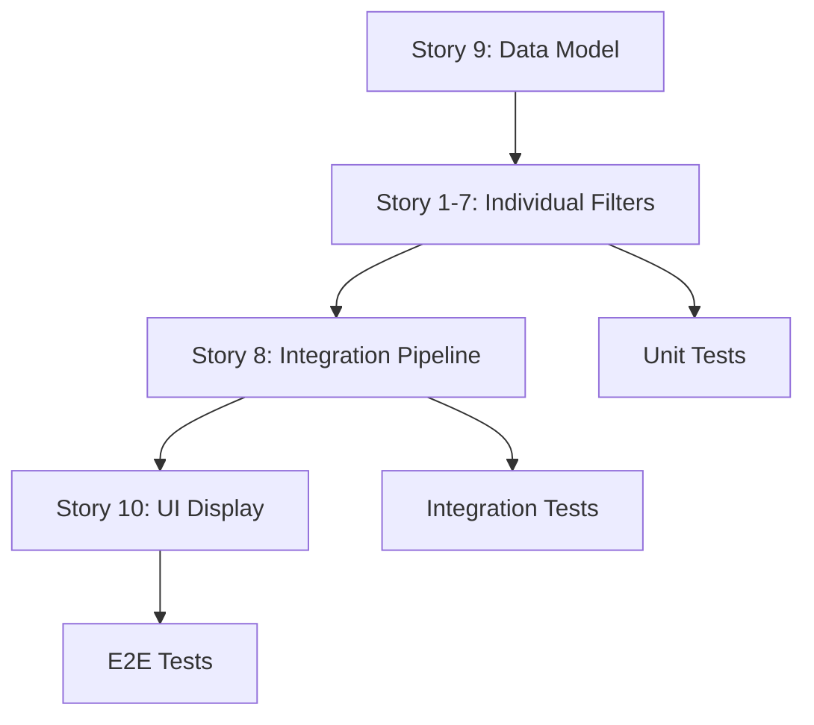

# Mingla Preferences Sheet - User Stories Documentation

**Project:** Mingla - Experience Discovery Platform  
**Platform:** React Native with Expo Go  
**Document Version:** 2.0  
**Last Updated:** December 16, 2025  
**Status:** Ready for Development

---

## Overview

This documentation provides comprehensive user stories for the Mingla Preferences Sheet and Card Generation system. Each story includes detailed acceptance criteria covering all scenarios, edge cases, and technical implementation details.

### Epic Goal

**As an** Explorer using the Mingla app  
**I need** a comprehensive preferences filtering system that accurately generates experience cards matching my exact criteria  
**So that** I discover only the experiences that align with my interests, budget, schedule, and location without wasting time on irrelevant options

---

## User Stories

### Core Filtering Stories

1. **[Story 1: Experience Type Selection & Card Filtering](./story-01-experience-type-selection.md)**
   - Multi-select experience types (Solo Adventure, First Date, Romantic, Friendly, Group Fun, Business)
   - OR logic filtering with dynamic category dependencies
   - 46 acceptance criteria

2. **[Story 2: Categories Selection with Dynamic Filtering](./story-02-categories-selection.md)**
   - 10 activity categories filtered by experience type
   - Auto-deselection of invalid categories
   - Combined helper text and badges
   - 32 acceptance criteria

3. **[Story 3: Budget per Person Filtering](./story-03-budget-filtering.md)**
   - Min/max budget inputs with preset buttons
   - Currency conversion support
   - Inclusive range filtering
   - 47 acceptance criteria

4. **[Story 4: Date & Time Selection with Opening Hours Validation](./story-04-date-time-selection.md)**
   - 4 date options (Now, Today, This Weekend, Pick a Date)
   - Opening hours validation with special hours support
   - Timezone handling
   - 52 acceptance criteria

5. **[Story 5: Travel Mode Selection & Calculation Engine](./story-05-travel-mode-selection.md)**
   - 4 travel modes (Walking, Biking, Transit, Driving)
   - Google Maps Distance Matrix API integration
   - 24-hour caching with haversine fallback
   - 45 acceptance criteria

### Advanced Filtering Stories

6. **[Story 6: Travel Limit Filtering (Required Constraint)](./story-06-travel-limit-filtering.md)**
   - REQUIRED time or distance constraint
   - Metric/Imperial unit support
   - Validation and progress indication
   - Coming soon

7. **[Story 7: Starting Location Selection (GPS & Search)](./story-07-starting-location.md)**
   - GPS with permission handling
   - Google Places Autocomplete search
   - IP-based fallback
   - Coming soon

8. **[Story 8: Complete Preference Application & Filter Pipeline](./story-08-preference-application.md)**
   - Complete filtering pipeline with AND/OR logic
   - 5-minute result caching
   - Total selections counter
   - Coming soon

### Data & UI Stories

9. **[Story 9: Card Data Model & API Contract](./story-09-card-data-model.md)**
   - Complete TypeScript interfaces
   - API endpoints and contracts
   - Environment configuration
   - Coming soon

10. **[Story 10: Card UI Display & Swipeable Deck Interface](./story-10-card-ui-display.md)**
    - Swipeable card deck (Tinder-style)
    - Card design matching prototype
    - Swipe-right-to-save functionality
    - Coming soon

### Additional Documentation

- **[Integration Tests](./integration-tests.md)** - Cross-story integration scenarios (Coming soon)
- **[Performance Requirements](./performance-requirements.md)** - Performance benchmarks and optimization (Coming soon)
- **[Accessibility Requirements](./accessibility-requirements.md)** - WCAG compliance and screen reader support (Coming soon)

---

## Quick Reference

### Filter Pipeline Order

The complete filter pipeline applies filters in this sequence:

```
All Cards (1000)
    ↓
1. Experience Type Filter (OR logic) → 450 cards
    ↓
2. Categories Filter (OR logic, AND with exp type) → 120 cards
    ↓
3. Budget Filter (inclusive range) → 80 cards
    ↓
4. Date/Time Filter (opening hours) → 30 cards
    ↓
5. Travel Limit Filter (time or distance) → 15 cards
    ↓
Final Results (15 cards)
```

### Technology Stack

- **Platform:** React Native with Expo Go
- **State Management:** React Hooks (useState, useEffect, useContext)
- **Location Services:** expo-location
- **Storage:** @react-native-async-storage/async-storage
- **Date Handling:** date-fns
- **Image Optimization:** expo-image
- **UI Components:** react-native-deck-swiper, lucide-react-native

### External APIs

- **Google Maps Distance Matrix API** - Travel time/distance calculations
- **Google Places Autocomplete API** - Location search
- **Exchange Rate API** - Currency conversion
- **IP Geolocation API** - Location fallback

### Acceptance Criteria Count

| Story | Title | AC Count | Status |
|-------|-------|----------|--------|
| 1 | Experience Type Selection | 46 | ✅ Complete |
| 2 | Categories Selection | 32 | ✅ Complete |
| 3 | Budget Filtering | 47 | ✅ Complete |
| 4 | Date & Time Selection | 52 | ✅ Complete |
| 5 | Travel Mode Selection | 45 | ✅ Complete |
| 6 | Travel Limit Filtering | TBD | 🚧 In Progress |
| 7 | Starting Location | TBD | 📝 Planned |
| 8 | Preference Application | TBD | 📝 Planned |
| 9 | Card Data Model | TBD | 📝 Planned |
| 10 | Card UI Display | TBD | 📝 Planned |

**Total AC Completed:** 222+

---

## How to Use This Documentation

### For Product Managers
- Review story titles and acceptance criteria to understand feature scope
- Use AC as basis for test cases and QA validation
- Reference edge cases for product decisions

### For Developers
- Start with Story 9 (Data Model) to understand data structures
- Implement stories 1-7 (filtering logic) with provided code examples
- Use Story 8 (Pipeline) to integrate all filters
- Build Story 10 (UI) last

### For QA Engineers
- Each acceptance criterion is a test case
- Test data is provided inline with AC
- Edge cases and error scenarios are explicitly documented

### For Designers
- Visual design specs in each story's "UI States" section
- Responsive layout requirements specified
- Accessibility requirements documented

---

## Development Workflow



### Recommended Implementation Order

1. **Story 9** - Set up data models and API contracts
2. **Story 7** - Implement location services (needed by Story 5)
3. **Story 1** - Experience Type filtering (simplest filter)
4. **Story 2** - Categories with dynamic filtering
5. **Story 3** - Budget with currency conversion
6. **Story 4** - Date/Time with opening hours
7. **Story 5** - Travel Mode with Google Maps API
8. **Story 6** - Travel Limit (depends on Stories 5 & 7)
9. **Story 8** - Complete pipeline integration
10. **Story 10** - UI and card display

---

## Success Criteria

### Filtering Accuracy
- ✅ 100% of generated cards match ALL applied filter criteria
- ✅ No false positives (cards that shouldn't match)
- ✅ No false negatives (cards that should match but don't)

### Performance
- ✅ Card generation completes in < 5 seconds for typical datasets (100-500 cards)
- ✅ Individual filter operations complete in < 200ms
- ✅ API cache hit rate > 80%

### User Experience
- ✅ Minimum 2 taps to apply preferences (Travel Limit + Apply)
- ✅ Filter application success rate > 95%
- ✅ Empty states provide clear guidance

### Code Quality
- ✅ All edge cases handled gracefully
- ✅ Comprehensive error logging
- ✅ Fallback mechanisms for API failures
- ✅ Accessibility compliance (WCAG 2.1 AA)

---

## Related Documentation

- [Mingla 6-Phase Refactoring Strategy](../../REFACTORING_SUMMARY.md)
- [Color Scheme Documentation](../../DESIGN_SYSTEM.md)
- [Swipe-Right-to-Save Functionality](../../SWIPE_FUNCTIONALITY.md)
- [Logo Update Implementation](../../CHANGELOG.md#logo-update)
- [Preferences Sheet Reordering](../../CHANGELOG.md#section-reordering)

---

## Contact & Support

For questions or clarifications about these user stories:
- **Product Questions:** Review acceptance criteria or create GitHub issue
- **Technical Questions:** Check code examples or consult technical lead
- **Design Questions:** Refer to "UI States" sections or consult design team

---

**Document Maintained By:** Mingla Development Team  
**Last Review:** December 16, 2025  
**Next Review:** January 2026
