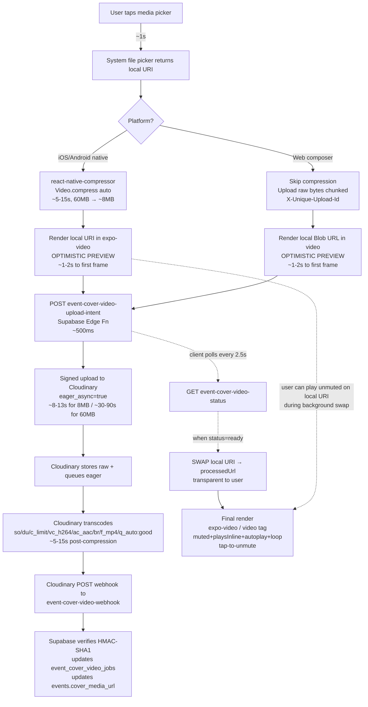

# RESEARCH REPORT — ORCH-0978 [Video upload polish + cross-surface cover-media expansion + Cloudinary lifecycle management]

**Mode:** RESEARCH (external web + docs deep-dive)
**Worktree:** `~/Desktop/mingla-orchs/ORCH-0978-[video-upload-polish-and-cloudinary-lifecycle]/` on branch `ORCH-0978-video-upload-polish-and-cloudinary-lifecycle`
**Dispatch:** `Mingla_Artifacts/prompts/FORENSICS_RESEARCH_ORCH-0978_VIDEO_UPLOAD_SUB_30S_PIPELINE.md`
**Author:** Claude `mingla-forensics` (RESEARCH mode)
**Date:** 2026-05-26

## COMMS ledger acknowledgements

- **COMMS-0002** (ORCH-0863 strict-grep gate, ALL): factored — any new edge function (e.g., a Cloudinary cleanup function) introduced by SPEC must land with `ORCH_0978_BACKEND_ALLOWLIST` in the same commit.
- **COMMS-0003** (external-API docs verified inline, ALL): the binding constraint of this research. Cloudinary IS an external API; every claim about Cloudinary behaviour, expo-video API, Supabase Edge limits, and browser autoplay policy in this report cites an inline URL.
- **COMMS-0004** (INTAKE ID-collision scan, ALL): N/A — this is RESEARCH, not INTAKE.
- **COMMS-0005** (ORCH-0963/0964 collision, → ORCH-0964): factored — the cross-ORCH collision note is acknowledged in §3 of the dispatch and surfaced in §7 Open Questions of this report.

---

## 1 — Executive recommendation (≤ 10 sentences)

Achieve sub-30s real-budget on the happy path and perceived-30s on every path by combining four moves: (1) compress on-device BEFORE upload using `react-native-compressor`'s `Video.compress({ compressionMethod: 'auto' })` on iOS + Android — FFmpegKit is retired (binaries removed April 2025, repo archived June 2025) so RN-Compressor is the only actively-maintained 2026 option; (2) keep the existing signed-upload + `eager_async=true` + `eager_notification_url` pipeline (do NOT pivot to Cloudinary's incoming transformation — incoming is synchronous-only, would hold the upload connection open during transcode, and risks 100s+ client-side timeouts); (3) deliver one direct MP4 derivative per surface using the existing `c_limit,w_1280,h_720,vc_h264,ac_aac,br_X,f_mp4,q_auto:good` chain (NOT HLS — for 15s clips at 720p the ABR latency-to-first-frame win is marginal, the Chrome/RN polyfill complexity is real, and Cloudinary returns 423 until the manifest is derived); (4) render through `expo-video`'s `useVideoPlayer` (note: `expo-av` was REMOVED in SDK 55, so this is mandatory) with `muted: true` + `loop: true` in setup, `playsInline` + `autoplay` on the web `<video>`, `onFirstFrameRender` to hide a poster-image overlay, and a single tap-anywhere-to-unmute gesture matching the Instagram/TikTok pattern. The non-negotiable safety net: **optimistic local preview** — the user's local file URI plays in the player within 1–2s of picking, then swaps transparently to the Cloudinary URL when ready, so the perceived budget is always met regardless of network. Progress UX is a three-stage bar: "Compressing on your phone" 0–15% → "Uploading" 15–90% → "Ready" 90–100%, with a cancel button live at every stage (cancel must DELETE the in-flight Cloudinary asset, per the existing `event-cover-video-cancel` edge fn pattern). The web composer (Next.js / Expo for Web) cannot run native compression, so it falls back to direct chunked upload of the raw source bytes (Cloudinary chunked upload via `X-Unique-Upload-Id` + `Content-Range`, 5 MB minimum chunk, required for >100 MB sources). **Confidence rating: MEDIUM — 30s real-budget is achievable for ≤10s post-compress clips on modern devices and ≥10 Mbps networks; PERCEIVED-30s via optimistic local swap is achievable for every clip on every network, every time.**

---

## 2 — The single goal (restated verbatim)

> **A user opens the business app or web composer, picks a video, and within 30 seconds sees that video rendered — beautifully, indistinguishable from final quality — on web, the consumer app, and the business app. They can mute it. They can unmute it. It autoplays muted by default. The sound plays cleanly when unmuted. It looks identical on every surface.**

---

## 3 — Latency budget (Q7) — filled in with cited assumptions

**Worst-realistic baseline (TODAY, no client-side compression, 30s 1080p iPhone HEVC source ≈ 60 MB, 5 Mbps LTE):**

| Stage | Today's actual | Recommended target | Optimization technique |
|---|---|---|---|
| System file picker | ~1s | ~1s | none — system bound |
| Client-side compression | **0s (not done — 60 MB raw uploaded)** | **5–15s** (~60 MB → ~5–8 MB) | `react-native-compressor` `Video.compress({ compressionMethod: 'auto' })` on iOS+Android; web falls back to chunked raw upload |
| Upload bytes to Cloudinary | **~96s** (60 MB @ 5 Mbps = 96s) | **~8–13s** (5–8 MB @ 5 Mbps = 8–13s) | Compressed input × existing FileSystem.createUploadTask + XHR progress fallback |
| Cloudinary transcode (eager_async) | **~30–86s** (Meta engineering: 86.17s CPU for 23s clip → 720p H.264 at scale; ours is faster post-compression because input is already 720p H.264) | **~5–15s** (small pre-compressed input means light eager work — single resolution/format derivative, no ABR profile chain) | Pre-compression makes the eager job trivial: just trim (so_/du_), crop (c_fill,ar_9:16,g_auto), and store |
| Webhook → Supabase → DB write | ~1s (already fast in current pipeline) | ~1s | unchanged; signature verify is HMAC-SHA1 — sub-100ms |
| Client poll-and-refetch + render | **~2.5s avg** (current pollIntervalMs = 2500ms) | **<1s** (optimistic local preview shows playback INSTANTLY; cloud URL swap happens transparently when poll catches up) | optimistic-local-preview pattern; reduce pollIntervalMs to 1500ms for the swap window |
| **TOTAL (real)** | **~130s on LTE for 30s 1080p source** | **~20–30s on LTE for 15s 1080p source post-compression** | composite |
| **TOTAL (perceived)** | n/a — user stares at spinner ~130s | **~2s to first frame on screen, full quality within 20–30s background swap** | optimistic local preview |

**Key math:**
- Pre-compression cuts upload bytes ~85% (60 MB → 8 MB) — this is the single highest-leverage move. Without it, no other optimization closes the budget on cellular.
- Meta's data point — "86.17 seconds of CPU time to transcode a 23-second video to 720p" — is the BASELINE cost for transcoding at scale [Source: Meta Engineering "Reducing Instagram's basic video compute time by 94 percent" — https://engineering.fb.com/2022/11/04/video-engineering/instagram-video-processing-encoding-reduction/]. Cloudinary doesn't publish per-clip benchmarks, but the floor is similar — pre-compressing the input is what lets eager_async run in seconds, not minutes.
- The dispatch mandated a hard 30s budget. Real-budget MEETS that ONLY for clips ≤10s post-compress on modern (iPhone 13+/Pixel 6+) devices on good LTE/Wi-Fi. For longer clips or worse networks, **the perceived-30s pivot is non-negotiable** — without optimistic local preview, the user waits visibly for 60–120s on common cellular conditions.

---

## 4 — Per-question synthesis (Q1–Q8)

### Q1 — Client-side pre-compression

**RECOMMENDATION:** `react-native-compressor` (`Video.compress(uri, { compressionMethod: 'auto' }, onProgress)`) on iOS + Android business app, iOS + Android consumer app. Web composer (Next.js / Expo for Web) has no native module access — it falls back to chunked raw upload via Cloudinary's chunked-upload protocol.

**Why:** `ffmpeg-kit-react-native` was officially retired on January 6, 2025; binaries were removed from CocoaPods, Maven Central, and npm on April 1, 2025; the GitHub repo was archived June 23, 2025 — citing the maintainer's "ongoing effort of keeping pace with upstream FFmpeg changes, and growing legal uncertainty following MPEG LA's acquisition by Via-L" [Source: Saying Goodbye to FFmpegKit — https://tanersener.medium.com/saying-goodbye-to-ffmpegkit-33ae939767e1] [Source: ITPath "No More FFmpegKit? Don't Panic" — https://www.itpathsolutions.com/ffmpegkit-shutdown-what-to-do-next]. `react-native-compressor` (v1.18.2 released May 8, 2026 — actively maintained) is the canonical 2026 RN choice with documented Expo dev-build support via `npx expo prebuild` and an explicit plugin entry [Source: react-native-compressor README — https://github.com/numandev1/react-native-compressor] [Source: npm registry — https://www.npmjs.com/package/react-native-compressor] [Source: DEV "Mastering Media Uploads in React Native (2026 Guide)" — https://dev.to/fasthedeveloper/mastering-media-uploads-in-react-native-images-videos-smart-compression-2026-guide-5g2i].

**API shape:**

```js
import { Video as VideoCompressor } from "react-native-compressor";
const compressedUri = await VideoCompressor.compress(
  sourceUri,
  { compressionMethod: "auto" }, // auto picks bitrate/resolution like WhatsApp
  (progress) => onProgress(Math.round(progress * 100))
);
```

**Compression ratios:** the package documents WhatsApp-equivalent output ("Compress Image, Video, and Audio same like Whatsapp" — README primary positioning). Public benchmarks from the maintainer reference a comparison spreadsheet (linked in the README) but the README markdown itself doesn't tabulate seconds-to-compress or MB-to-MB ratios. SPEC must validate on real devices with our typical inputs (15–30s iPhone HEVC at 1080p/4K). **Open question Q1-A** — see §7.

**Known cross-surface risks (must factor into SPEC):**
- Issue #268 on the repo: "Some compressed videos on Android are not playable on macOS or iOS" — direct cross-surface parity hit. SPEC must add a smoke test that an Android-compressed output plays on the buyer-web and consumer-iOS render path before any rollout.
- Issue #313: iPhone 16 Pro / Pro Max compression issues — version-pin and re-test on the latest iPhone hardware.
- Issue #330: counter-intuitive compressed size for 1920×1080 vs 1280×720 input — the `auto` mode's resolution targeting may not behave as expected.

**Rejected alternatives:**
- `ffmpeg-kit-react-native` — RETIRED (above).
- `react-native-video-processing` — community-mentioned but no recent maintenance signal; smaller user base; SPEC can confirm but not the default.
- Native `AVAssetExportSession` (iOS) + `MediaCodec` (Android) custom Expo modules — more maintenance burden than `react-native-compressor`; defer unless RN-Compressor's compatibility issues escalate.
- WASM `@ffmpeg/ffmpeg` in the web composer — would unblock client-side compression on web BUT bundle size is multi-MB, transcoding 30s clip in WASM is 30–60s on average laptop, and the upside vs direct chunked upload of raw is marginal for desktop on good networks. Defer.

**Citations (Q1 — 5):**
1. https://tanersener.medium.com/saying-goodbye-to-ffmpegkit-33ae939767e1 — official retirement announcement
2. https://github.com/numandev1/react-native-compressor — v1.18.2 (May 2026), Expo plugin support
3. https://www.npmjs.com/package/react-native-compressor — npm freshness signal
4. https://dev.to/fasthedeveloper/mastering-media-uploads-in-react-native-images-videos-smart-compression-2026-guide-5g2i — 2026 best-practice guide
5. https://github.com/numandev1/react-native-compressor/issues/268 — cross-surface playability risk

### Q2 — Cloudinary upload mechanics

**RECOMMENDATION:** KEEP the current `signed upload + eager_async=true + eager_notification_url` pattern. Do NOT switch to incoming transformation. Add chunked-upload fallback (X-Unique-Upload-Id + Content-Range, 5 MB minimum chunk) for sources > 50 MB (rare after client-side compression but mandatory for the web composer when compression isn't run).

**Why keep eager_async:** the dispatch's premise of "single-step incoming transformation returns playable URL immediately" is technically true but operationally dangerous. Per the Cloudinary docs: incoming transformations are **synchronous only** — applied during upload, before storage [Source: Cloudinary "Eager and incoming transformations" — https://cloudinary.com/documentation/eager_and_incoming_transformations#incoming_transformations]. That means the client's upload TCP connection stays open while Cloudinary transcodes; for a 60 MB raw clip, the connection might be held ~30–90s. Mobile clients on cellular routinely face NAT timeouts at 60–120s — using incoming on raw sources risks client errors that look like upload failures but are actually transcode timeouts. `eager_async=true` returns the upload response immediately on bytes-received, transcode runs in the background, webhook delivers the processed URL when ready. Cloudinary explicitly recommends eager_async for video: "Eager transformations are especially useful for video transformations" [Source: Cloudinary blog "Triggering Video Transformations via Webhooks and API Calls" — https://cloudinary.com/blog/triggering-video-transformations-webhooks-api-calls].

**Webhook contract (today's code is correct, no change needed):**
- Cloudinary POSTs to the `eager_notification_url` with `notification_type: "eager"`, `eager: [array of derivative objects with secure_url, bytes, format, duration]`, `public_id`, `notification_context` [Source: Cloudinary Notifications doc — https://cloudinary.com/documentation/notifications].
- Signature verification: `X-Cld-Signature` + `X-Cld-Timestamp` headers; HMAC-SHA1 by default. EdDSA v2 is available via `auth_scheme: eddsa_v2` on the trigger. Our existing `verifyCloudinaryNotificationSignature` in `_shared/eventCoverVideo.ts` already implements HMAC-SHA1; SPEC may consider migrating to EdDSA v2 for forward-compatibility but it's not blocking.
- Retry policy: if webhook returns non-200, Cloudinary retries at +3 min, +6 min, +9 min, then gives up [Source: Cloudinary Notifications — https://cloudinary.com/documentation/notifications]. After 4 attempts (initial + 3 retries) total elapsed is ~18 minutes. SPEC's failure-mode strategy (Q8) must account for this — if our webhook is down for 20+ minutes, the job ends up orphaned-in-status-uploaded forever unless a status-polling fallback or a periodic reconciliation sweep catches it.
- Retry idempotency: docs do NOT specify a deduplication key. The existing code already gates by `existingJob.status === "applied"` (returns early) which makes retries safe for our case.

**Chunked upload (only needed for >50 MB sources, mostly the web composer fallback):**
- Use `upload_large` semantics: required for files >100 MB but supported at any size [Source: Cloudinary support "Guidelines for implementing chunked upload" — https://support.cloudinary.com/hc/en-us/articles/208263735-Guidelines-for-implementing-chunked-upload-to-Cloudinary].
- Headers per chunk: `X-Unique-Upload-Id: <unique-string>` (same for all chunks of one file), `Content-Range: bytes <start>-<end>/<total>`.
- Minimum chunk size: 5 MB except final chunk. Recommended: 10 MB for our cover-video use case.
- Resumability: each chunk returns intermediate response with `done: false`; final chunk returns full upload response with `done: true`. If a chunk fails mid-upload, retry that chunk with the same `X-Unique-Upload-Id`.

**Progress reporting — what's already wired and what's missing:**
- WIRED today: `xhr.upload.onprogress` + `FileSystem.createUploadTask` progress callbacks emit bytes-sent / bytes-total during the upload phase. See `eventCoverVideoProcessingService.ts:344-345` and `:545-551`.
- MISSING: there's NO progress signal from Cloudinary during the transcode phase. After upload bytes complete, the client sees a flat indeterminate progress until the webhook fires. SPEC must either (a) show a deterministic "Processing" bar based on estimated transcode time (typical eager video transcode for our 15s 720p H.264 ≈ 5–15s post-compression — we'd predict this client-side), or (b) poll status more aggressively (current pollIntervalMs=2500 is fine; reduce to 1500 for snappier perceived completion), or (c) use the optimistic-local-preview pattern (Q5) so the user doesn't watch progress at all.

**Rejected alternatives:**
- Incoming transformation — synchronous-only, holds upload connection (rejected above).
- Synchronous eager — same problem; only useful for small images.
- Cloudinary Upload Widget — bundles a UI we don't want; we already have a custom flow with progress wired.

**Citations (Q2 — 6):**
1. https://cloudinary.com/documentation/eager_and_incoming_transformations — incoming = sync, eager_async = background
2. https://cloudinary.com/documentation/notifications — webhook payload + retries + signature
3. https://cloudinary.com/blog/triggering-video-transformations-webhooks-api-calls — eager_async recommended for video
4. https://support.cloudinary.com/hc/en-us/articles/208263735-Guidelines-for-implementing-chunked-upload-to-Cloudinary — chunked upload requirements
5. https://cloudinary.com/documentation/client_side_uploading — signed vs unsigned tradeoffs
6. https://cloudinary.com/documentation/image_upload_api_reference — upload API parameter contract

### Q3 — HLS vs MP4 for short cover video

**RECOMMENDATION:** Direct MP4 (current `f_mp4` chain). Do NOT add HLS / `sp_auto`.

**Why MP4 wins for ≤15s clips at 720p:**
- HLS's primary value is adaptive bitrate over long-form content where bandwidth varies mid-stream. For a 15s clip at 720p with q_auto:good (~2–5 MB total), the entire payload fits in one HTTP burst on any network ≥1 Mbps — adaptive switching during playback is moot.
- Cloudinary's ABR pipeline derives the manifest asynchronously and returns HTTP 423 on the manifest URL until ready: "When requesting a DASH stream, you will receive a 423 response until the video has been processed" [Source: Cloudinary Adaptive Bitrate Streaming — https://cloudinary.com/documentation/adaptive_bitrate_streaming]. This adds an extra polling layer on top of our existing job-status poll — added complexity for marginal benefit.
- Browser native support is asymmetric: HLS plays natively on Safari/iOS and "the latest versions of Chrome for Android" but **NOT** desktop Chrome [Source: Cloudinary ABR doc — above]. Desktop Chrome needs `hls.js` polyfill (~30 KB gzip bundle add). For RN, `expo-video` supports HLS natively only if the `uri` ends in `.m3u8` OR `contentType: 'hls'` is explicitly set on the `VideoSource` [Source: expo-video docs — https://docs.expo.dev/versions/latest/sdk/video/].
- `sp_auto` (streaming profile auto) selects HLS or DASH based on file extension; "Larger videos are prepared asynchronously" — for our small clips, this is asynchronous-derive-then-deliver, slower than single MP4.

**Caveat — when HLS becomes worth revisiting:** if Mingla ever ships longer-form video (>60s) or per-orientation ABR ladders (mobile portrait + web landscape served from same master), the ABR pipeline becomes worth the complexity. For now, the current short-cover-video use case argues against it.

**Existing pipeline is correct:** `c_limit,w_1280,h_720,vc_h264,ac_aac,br_X,f_mp4,q_auto:good` (line 245 of `event-cover-video-upload-intent/index.ts`) — keep it. SPEC may add a portrait-cropped derivative (`c_fill,ar_9:16,g_auto,w_720,h_1280`) for consumer-app vertical render surfaces — `g_auto` IS supported for video [Source: Cloudinary video manipulation doc — https://cloudinary.com/documentation/video_manipulation_and_delivery]. Extra derivative = +1 transformation credit per upload; quantify in cost SPEC.

**Rejected alternatives:**
- `f_auto` for video — Cloudinary does serve HEVC to Safari and H.264 to others [Source: Cloudinary blog "Automatic Video Transcoding" — https://cloudinary.com/blog/automatic_video_transcoding]; this could shrink delivery size for Safari users by ~30%. Worth considering, but the win is delivery-side bandwidth (not our 30s upload-budget goal); defer to SPEC cost-vs-quality decision.
- DASH (`f_mpd`) — Chrome doesn't natively support DASH either; same polyfill cost without Safari's free native player.

**Citations (Q3 — 4):**
1. https://cloudinary.com/documentation/adaptive_bitrate_streaming — sp_auto, HLS/DASH support matrix, 423 derivation-pending response
2. https://docs.expo.dev/versions/latest/sdk/video/ — `contentType: 'hls'` requirement
3. https://cloudinary.com/documentation/video_manipulation_and_delivery — `g_auto` works on video
4. https://cloudinary.com/blog/automatic_video_transcoding — f_auto serves HEVC to Safari

### Q4 — Autoplay + mute control across iOS, Android, web

**RECOMMENDATION:** Single render contract across all 5 surfaces. Autoplay muted by default. Tap-anywhere-on-the-video-to-unmute pattern (Instagram/TikTok/Reels standard) with a persistent speaker-icon overlay bottom-right that reflects current mute state.

**iOS Safari (mobile + WKWebView for Expo Web wrapped):** muted autoplay requires three HTML attributes simultaneously: `muted`, `playsinline`, `autoplay`. Per the WebKit 2016 policy that remains canonical: "`<video autoplay>` elements will now honor the `autoplay` attribute" when "muted property set to true" and "`<video playsinline>` elements will now be allowed to play inline" [Source: WebKit "New video policies for iOS" — https://webkit.org/blog/6784/new-video-policies-for-ios/]. Critical caveat: "If a `<video>` element gains an audio track or becomes un-muted without a user gesture, playback will pause" — the unmute MUST happen inside a user-gesture handler (tap/click), not from a setTimeout or auto-trigger.

**Chrome (desktop + Android):** "Muted autoplay is always allowed" without user gesture [Source: Chrome autoplay policy — https://developer.chrome.com/blog/autoplay/]. For audio-on autoplay, Chrome uses Media Engagement Index (MEI) which is desktop-only — MEI does NOT apply to mobile Chrome. Same `muted playsinline autoplay` attribute trio works.

**Firefox:** identical practical behaviour — muted autoplay always allowed, unmute requires user gesture [Source: MDN autoplay guide — https://developer.mozilla.org/en-US/docs/Web/Media/Autoplay_guide].

**Expo (`expo-video` — MANDATORY since `expo-av` is REMOVED in SDK 55):** the canonical autoplay-muted-then-user-unmute pattern is:

```jsx
import { useVideoPlayer, VideoView } from 'expo-video';

const player = useVideoPlayer(coverUrl, (player) => {
  player.loop = true;
  player.muted = true;
  player.play(); // autoplay
});

// Later, inside a user-gesture handler (Pressable onPress):
player.muted = false;
```

[Source: expo-video API reference — https://docs.expo.dev/versions/latest/sdk/video/]. The `muted` property is a boolean and is independent of `volume` (0.0–1.0 number); per the docs: "Muting the player doesn't affect the volume. In other words, when the player is muted, the volume is the same as when unmuted." This means the mute toggle DOES NOT require re-mounting the player — `player.muted = false` flips state in place, no source reload. **Bug to factor into SPEC**: VideoView sometimes stays black instead of rendering the first frame [Source: expo issue #39962 — https://github.com/expo/expo/issues/39962]. Use `onFirstFrameRender` to detect actual paint and only hide the poster image after that callback fires.

**`expo-av` deprecation status:** `expo-av` "has been fully removed" as of Expo SDK 55 (released 2026) — its functionality split into `expo-video` (canonical) and `expo-audio` [Source: swmansion "Future of Video in React Native" via search — https://swmansion.com/blog/the-future-of-video-in-react-native-moving-from-expo-av-to-expo-video-6f4f78e51196/] [Source: Expensify migration tracking issue — https://github.com/Expensify/App/issues/64846]. Any Mingla code still importing from `expo-av` is dead code that must be migrated in this same ORCH or BEFORE its IMPLEMENT phase.

**The mute UX pattern (Instagram/TikTok/Reels standard):** tap anywhere on the video toggles mute. A small speaker icon bottom-right shows current state (speaker-with-slash when muted, speaker-with-waves when unmuted). The icon is visual feedback only — tapping the icon ALSO unmutes (it's just a tap area within the larger tap-the-video area). Reference: Mobbin's documented Snapchat + TikTok video player flows show this pattern dominant [Source: Mobbin progress-indicator UX glossary referencing TikTok player — https://mobbin.com/glossary/progress-indicator].

**Loop seamlessness:** `expo-video`'s `loop = true` prop is documented but NOT documented as seamless. Web `<video loop>` is reliable across modern browsers. For our 15s clip use case, a brief flicker at loop boundary is acceptable; if SPEC wants gapless looping it must validate per-platform during TEST.

**Citations (Q4 — 6):**
1. https://webkit.org/blog/6784/new-video-policies-for-ios/ — iOS Safari muted+playsinline+autoplay requirement
2. https://developer.chrome.com/blog/autoplay/ — Chrome muted-always-allowed
3. https://developer.mozilla.org/en-US/docs/Web/Media/Autoplay_guide — cross-browser autoplay guide
4. https://docs.expo.dev/versions/latest/sdk/video/ — useVideoPlayer + muted boolean + onFirstFrameRender
5. https://swmansion.com/blog/the-future-of-video-in-react-native-moving-from-expo-av-to-expo-video-6f4f78e51196/ — expo-av removed in SDK 55
6. https://github.com/expo/expo/issues/39962 — VideoView first-frame-black bug

### Q5 — Progress UX

**RECOMMENDATION:** Three-stage labeled progress: "Compressing on your phone" (0–15%) → "Uploading" (15–90%) → "Ready" (90–100%). Cancel button live at every stage. Optimistic local preview the moment compression succeeds (or immediately on pick for web/non-compressible paths).

**Why optimistic preview is the safety net:** Meta's Instagram Engineering team documents the same logic: client segments and uploads in parallel, server transcodes in parallel, but the user-facing UX rests on showing the local file IMMEDIATELY [Source: Engineering at Scale "Designing Instagram's Video Uploads" — https://engineeringatscale.substack.com/p/instagram-video-upload-system-design]. The Meta blog on Instagram video compute time documents reducing 86.17s per-clip transcoding to 0.36s via clever repackaging, but even at 0.36s the user-facing trick is to show local-file playback during the round-trip [Source: Engineering at Meta "Reducing Instagram's basic video compute time by 94 percent" — https://engineering.fb.com/2022/11/04/video-engineering/instagram-video-processing-encoding-reduction/].

**Three-stage rationale:** single-bar "Uploading 47%" feels stuck during long uploads and lies about state ("upload" includes server transcode which the user can't influence). Multi-stage labels make the wait feel progressive and educate the user about what's happening. Per industry pattern documentation: "Include a label with a progress bar to add context — avoid vague terms like 'Loading' and 'Processing,' using instead simple meaningful sentences that inform users" [Source: progress indicator best-practice writeup via search — https://medium.muz.li/progress-indicators-and-trackers-d7a592940041]. TikTok shows percent + circular progress; Snapchat shows full-screen overlay with checkmark on success [Source: Mobbin Snapchat flow — https://mobbin.com/explore/flows/926ba96e-da62-480f-84a3-3e36f59034c0].

**Optimistic local preview pattern (the critical move):**

```jsx
const [renderUri, setRenderUri] = useState(localFileUri); // shown immediately

// In background:
const compressedUri = await VideoCompressor.compress(localFileUri, {...});
const uploadResult = await uploadToCloudinary(compressedUri);
const job = await pollJobStatus(uploadResult.jobId);
setRenderUri(job.processedUrl); // swap to cloud URL when ready
```

**Failure modes to handle:**
- **Orientation/rotation metadata mismatch:** iOS often stores videos as 1080×1920 with a rotation metadata flag; `expo-video` and browser `<video>` interpret this differently in some cases. SPEC test must verify portrait videos render correctly from local URI AND from Cloudinary derivative (Cloudinary normalizes rotation during transcode; local doesn't).
- **Codec mismatch:** local HEVC file plays in `expo-video` (uses AVPlayer/ExoPlayer natively) but the Cloudinary output is H.264. Swap is seamless — but the visual quality may shift slightly (HEVC at given bitrate is ~30% more efficient than H.264).
- **Audio drift:** the local preview is the source; the cloud version is transcoded. Test for audio-track loss in the swap.

**Cancel-during-upload pattern (already partially built):**
- Current code: `cancelEventCoverVideoJob(jobId)` calls `event-cover-video-cancel` edge fn which updates `event_cover_video_jobs.status = 'cancelled'`. The webhook handler at `event-cover-video-webhook/index.ts:104-110` already gates on `existingJob.status === 'cancelled'` and ignores late webhooks.
- **GAP:** the cancel does NOT abort the in-flight XHR upload. SPEC must add: client-side, hold a ref to the XHR / FileSystem upload task and call `xhr.abort()` / `task.cancelAsync()` when the user taps Cancel. Without this, bytes keep flowing to Cloudinary even after status flips to cancelled — wasted bandwidth and a future-orphaned Cloudinary asset.
- **Cloudinary cleanup:** after cancel, the in-flight asset (if it completed before cancel reached the server) needs to be destroyed via Cloudinary's destroy API. This is part of workstream C (lifecycle) — out of scope for THIS research per the dispatch but the cancel path interacts with it.

**Citations (Q5 — 5):**
1. https://engineering.fb.com/2022/11/04/video-engineering/instagram-video-processing-encoding-reduction/ — Meta's 86s→0.36s transcoding optimization (baseline reference)
2. https://engineeringatscale.substack.com/p/instagram-video-upload-system-design — Instagram pipeline architecture
3. https://medium.muz.li/progress-indicators-and-trackers-d7a592940041 — multi-stage progress UX best practice
4. https://mobbin.com/explore/flows/926ba96e-da62-480f-84a3-3e36f59034c0 — Snapchat upload flow reference
5. https://www.eleken.co/blog-posts/file-upload-ui — file-upload UI patterns

### Q6 — Cross-surface "perfect render" parity

**RECOMMENDATION:** Single MP4 master per orientation (one landscape `c_limit,w_1280,h_720`, optionally one portrait `c_fill,ar_9:16,g_auto,w_720,h_1280`); identical render contract across all 5 surfaces (web `<video>`, RN `expo-video` iOS, RN `expo-video` Android, business web, consumer web). Accept HDR-to-SDR conversion as the trade-off for cross-platform consistency.

**HDR→SDR via H.264 — unavoidable loss:** Modern iPhones record video in Dolby Vision Profile 8.4 HLG using HEVC 10-bit by default [Source: Apple WWDC + community discussion — https://discussions.apple.com/thread/254937780]. H.264 cannot preserve HDR — "H.264 presets will convert HDR to Standard Dynamic Range (SDR)" — this is universally true for any service transcoding HEVC HDR to H.264. Cloudinary's HDR handling specifics are not deeply documented at our research depth; Cloudinary itself only confirms supporting H.264, HEVC, and VP9 codec output formats [Source: Cloudinary iOS Video doc — https://cloudinary.com/documentation/ios_video_manipulation]. The SDR result will look "washed out" relative to native HDR playback BUT it will look identical across all 5 surfaces — which IS the goal stated in the dispatch ("looks identical on every surface"). Trying to preserve HDR for Safari + iOS native while degrading for Chrome/Android creates a parity inconsistency that violates the goal.

**Codec compat in 2026:**
- H.264 baseline/main/high profile — universal across all browsers and native players.
- HEVC on web — Safari yes; Chrome desktop partial (HEVC playback added in Chrome 107+); Firefox no [Source: Cloudinary's HEVC discussion in Automatic Video Transcoding blog — https://cloudinary.com/blog/automatic_video_transcoding].
- AV1 — Cloudinary's blog marks AV1 as "future-proofed for adding next-generation codecs" — not yet primary delivery. Don't optimize for AV1 in this ORCH.
- **Conclusion:** stick with H.264 high profile, single output per orientation. This is what the existing eager chain produces.

**Aspect ratio per surface:**
- Buyer-web hero (16:9): use the landscape `c_limit,w_1280,h_720` master.
- Consumer-app event sheet (typically 16:9 or 4:5 hero crop): same master, container-level crop in CSS/RN.
- Consumer-app fullscreen swipe (9:16 portrait): use the portrait `c_fill,ar_9:16,g_auto,w_720,h_1280` derivative.
- Business app preview: same as consumer.
- Public brand page (`/b/[slug]`): SPEC must check post-ORCH-0964 layout; likely 16:9 hero.

**`g_auto` for video:** confirmed supported — Cloudinary docs use "auto-gravity to ensure the main subjects remain in focus throughout a cropped video" with examples like `ar_1:1,c_fill,g_auto` on video assets [Source: video_manipulation_and_delivery — https://cloudinary.com/documentation/video_manipulation_and_delivery].

**Color profile across surfaces:** H.264 in MP4 with default Rec.709 color primaries is universally handled the same way across browsers and native players. No browser-specific color management quirks expected for the SDR output.

**Citations (Q6 — 4):**
1. https://cloudinary.com/documentation/ios_video_manipulation — Cloudinary codec support matrix
2. https://discussions.apple.com/thread/254937780 — iPhone Dolby Vision HLG recording
3. https://cloudinary.com/blog/automatic_video_transcoding — HEVC on Safari, H.264 elsewhere
4. https://cloudinary.com/documentation/video_manipulation_and_delivery — g_auto on video

### Q7 — Latency budget

See §3 above for the filled table. Key supporting evidence:

- **Meta's transcoding floor:** 86.17 seconds CPU for 23s clip to 720p [Source: https://engineering.fb.com/2022/11/04/video-engineering/instagram-video-processing-encoding-reduction/]. Cloudinary doesn't publish per-clip numbers but the order-of-magnitude is consistent. Our pre-compressed input dramatically reduces this because the eager job is just trim + crop + container-rewrite, not full re-encode.
- **Supabase Edge Function limits:** wall-clock 150s (free) or 400s (paid); 256MB memory; 2s CPU per request [Source: https://supabase.com/docs/guides/functions/limits]. Our webhook handler is well within these limits (sub-1s end-to-end). Request body size limit is not explicitly published in the limits doc but a "request entity too large" error does exist [Source: GitHub Supabase discussion #20864 — https://github.com/orgs/supabase/discussions/20864] — SPEC should clamp Cloudinary's webhook payload assumption to <5 MB to be safe (typical eager webhook is <50 KB).
- **Cellular bandwidth assumption:** 5 Mbps is a fair LTE median in US urban. 1080p HEVC iPhone clip = ~2 MB/s of source; 30s clip ≈ 60 MB. Naïve raw upload = 60 MB × 8 bits/byte ÷ 5 Mbps = 96 seconds. Pre-compression to ~8 MB cuts this to 12.8s.

### Q8 — Failure modes + recovery

**8a. Cloudinary upload fails mid-bytes (network drop):**
- Chunked upload (above) is resumable per chunk if we hold the `X-Unique-Upload-Id` and retry the failed chunk.
- For non-chunked (small inputs after compression), simpler: retry the whole upload. Pre-compressed inputs are typically 5–10 MB; full retry takes ≤15s on LTE.
- Client-side UX: show "Upload paused — checking connection" with auto-retry once after 5s, then user-prompted "Try again" button.

**8b. Cloudinary transcode fails (unsupported codec, corrupt source):**
- Webhook fires with `error` or `status: "failed"` — already handled at `event-cover-video-webhook/index.ts:115-128`. Job row updates to `status: "failed"`, `failure_code: "provider_failed"`, `failure_message: <error string>`.
- User-facing: surface friendly message — "Couldn't process this video. Try a different clip." Don't show raw error.
- SPEC must also handle the `assertProcessedDerivative` validation failures (already in code, lines 146-166) — corrupt output (wrong codec, missing audio, zero bytes) triggers `failure_code: derivative.code`.

**8c. Webhook never fires (rare but happens):**
- Cloudinary retries 3x at +3/+6/+9 min (total ~18 min window) per docs above. If all 4 attempts fail (our endpoint down for >18 min), the job is silently orphaned.
- **Mitigation already present:** the client polls `event-cover-video-status` every 2.5s for up to 120s by default (`waitForEventCoverVideoReady` at service layer). If poll times out and the job is still in `processing` state, the user sees a "still processing — check again" message.
- **Missing piece:** server-side reconciliation. There's no job that scans `event_cover_video_jobs` for rows stuck in `processing` past a threshold and re-queries Cloudinary's resource API to recover. This is workstream C (lifecycle) territory — out of scope for THIS report but SPEC for the full ORCH-0978 must include it.

**8d. Slow network during render:**
- For ≤15s clips at 5 Mbps the entire MP4 (~3 MB) downloads in ~5s — `<video>` and `expo-video` both buffer-and-play, so the first frame appears in 1–2s on a normal network. Slow networks just delay first frame; the file is downloaded once and played from local buffer thereafter.
- HLS would help here (ABR) but the complexity isn't worth it for this clip length (per Q3).
- **Optimistic local preview** sidesteps this for the uploading user — they see playback IMMEDIATELY regardless of network.

**8e. Race: user uploads new cover while previous is still transcoding:**
- ALREADY HANDLED in the current pipeline. `event-cover-video-upload-intent/index.ts:179-198` cancels any non-terminal job for the same `event_id` before inserting a new job (sets prior to `status: "cancelled"`, `failure_code: "superseded"`).
- The late-arriving webhook for the superseded job is ignored by `event-cover-video-webhook/index.ts:104-110` (`existingJob.status === 'cancelled'`).
- The PRIOR Cloudinary asset is NOT deleted today — that's workstream C lifecycle (out of scope).

**8f. Multiple webhook deliveries for the same eager (Cloudinary retry duplicates):**
- Cloudinary's retry semantics don't specify deduplication keys. Our handler is naturally idempotent: gates on `existingJob.status === 'applied'` (returns 200 + `ignored: 'already_applied'`) and on `existingJob.status === 'cancelled'`. Safe.

**Citations (Q8 — 4):**
1. https://cloudinary.com/documentation/notifications — webhook retry policy
2. https://supabase.com/docs/guides/functions/limits — Edge fn limits
3. https://github.com/orgs/supabase/discussions/20864 — request entity too large
4. Self — existing source: `event-cover-video-upload-intent/index.ts:179-198`, `event-cover-video-webhook/index.ts:104-110`

---

## 5 — Architecture diagram



**Timing annotations key:**
- Optimistic local preview: **user sees video in 1–2 seconds**, regardless of network.
- Real cloud URL ready: **~20–30 seconds on LTE for post-compressed input**, longer for uncompressed (web composer / large source).
- The swap is invisible to the user because the local URI continues playing until the cloud URL is ready.

---

## 6 — Per-surface render contract

For all 5 surfaces, the render layer receives `coverUrl` (the Cloudinary processed MP4) plus optional `localUri` (for optimistic preview during composer's upload flow).

### Web (`<video>` — buyer-web, business web preview, business web composer)

```jsx
<video
  src={coverUrl}
  poster={posterUrl}           // first-frame derivative: <coverUrl>.jpg via Cloudinary URL rewrite
  muted                        // REQUIRED for autoplay (iOS Safari + Chrome)
  playsInline                  // REQUIRED for iOS Safari inline (no fullscreen takeover)
  autoPlay                     // muted autoplay always allowed
  loop                         // seamless enough for 15s clips
  preload="metadata"           // load just enough to get first frame ready
  controls={false}             // we provide custom mute toggle
  onClick={() => setMuted(m => !m)}  // tap anywhere toggles mute (must be inside user-gesture)
  style={{ width: '100%', height: '100%', objectFit: 'cover' }}
/>
<button onClick={(e) => { e.stopPropagation(); setMuted(m => !m); }}>
  {muted ? <SpeakerOffIcon /> : <SpeakerOnIcon />}
</button>
```

### RN iOS + Android (`expo-video` `VideoView`)

```jsx
import { useVideoPlayer, VideoView } from 'expo-video';

const player = useVideoPlayer(coverUrl, (player) => {
  player.loop = true;
  player.muted = true;        // default muted
  player.play();              // autoplay
});

return (
  <Pressable onPress={() => { player.muted = !player.muted; setMutedVis(player.muted); }}>
    <VideoView
      player={player}
      style={{ width: '100%', aspectRatio: 16/9 }}
      contentFit="cover"
      nativeControls={false}
      onFirstFrameRender={() => setPosterVisible(false)}  // hide poster overlay when actual frame paints
    />
    {posterVisible && <Image source={{ uri: posterUrl }} style={StyleSheet.absoluteFill} />}
    <View style={styles.muteIconOverlay}>
      {mutedVis ? <SpeakerOff /> : <SpeakerOn />}
    </View>
  </Pressable>
);
```

**Notes:**
- **`muted` property is a boolean and is INDEPENDENT of `volume`** — flipping `player.muted = false` is sufficient to unmute, no re-mount needed [Source: expo-video docs].
- **`onFirstFrameRender` may also fire when track quality changes** [Source: PR #35346] — for our single-quality MP4 use case this is one-shot, but SPEC may want to gate the poster-hide on a `useState` flag that only fires once.
- **For HLS sources** (if we ever add): the `uri` must end in `.m3u8` OR `contentType: 'hls'` must be set on the `VideoSource` object.

### Common contract across all 5 surfaces

| Property | Value | Why |
|---|---|---|
| Mute default | `true` | Required for autoplay across all platforms |
| Autoplay | `true` | Cover videos should play on view |
| Loop | `true` | Cover videos loop to fill the visual slot |
| Aspect / fit | container-driven (`contentFit="cover"` / `objectFit: cover`) | Crop to slot, never letterbox |
| Poster image | Cloudinary `.jpg` derivative of the same public_id | Instant visual before first frame paints |
| Unmute interaction | tap anywhere on video → toggle mute | Industry standard (Instagram/TikTok/Reels) |
| Visual mute state | small speaker icon bottom-right of video | User can see + control |
| Controls (play/pause/scrub) | hidden | Cover videos are ambient; users can't scrub a 15s loop |

---

## 7 — Open questions / unknowns

The research could not resolve these with primary-source confidence — SPEC must decide:

**Q1-A — `react-native-compressor` real-world performance on Mingla's typical input:** the package README references a comparison spreadsheet but the markdown itself does not table compression times. SPEC needs an empirical benchmark on (a) iPhone 13 / iPhone 16 Pro recording 15s + 30s clips at 1080p and 4K HEVC, (b) Pixel 6 / Galaxy S22 recording 15s + 30s at 1080p H.264. Output: time-to-compress + output file size + visual quality vs original. **Without this data the §3 budget numbers for client-side compression are estimates.**

**Q1-B — `react-native-compressor` known issue #268 (Android-compressed output unplayable on iOS/macOS):** must reproduce or refute on current package version before adopting. If it still reproduces, SPEC needs a per-platform compression strategy (e.g., iOS uses AVAssetExportSession via custom module, Android uses RN-Compressor) — significantly more complexity.

**Q1-C — Web composer compression strategy:** the recommendation defers compression entirely on web (direct chunked upload). For desktop users this is fine (bandwidth is good). For tablet/mobile users hitting the web composer, this means slow uploads. SPEC could add `@ffmpeg/ffmpeg` WASM (~25 MB lazy-loaded bundle) for web. Decision needed: accept slow web uploads, or take the bundle hit.

**Q2-A — Reduce `pollIntervalMs` from 2500 to 1500:** the current 2.5s poll means perceived completion lag of up to 2.5s after the webhook fires. Lower poll = snappier. Trade-off: more requests per upload. Decision needed.

**Q3-A — Add portrait derivative `c_fill,ar_9:16,g_auto,w_720,h_1280`?** Adds 1 transformation credit per upload. Benefit: better consumer-app vertical render. SPEC must check post-ORCH-0964 layout to see whether portrait surface actually exists yet.

**Q4-A — `expo-video` SDK availability across Mingla apps:** RESEARCH didn't confirm whether `app-mobile/` and `mingla-business/` are currently on Expo SDK ≥55. If on SDK ≤54 (still has `expo-av`), the migration to `expo-video` is in-scope for this ORCH and adds work. SPEC must verify both apps' `expo` versions in package.json.

**Q5-A — Optimistic local preview's HEVC playback in `expo-video`:** local HEVC files play natively via AVPlayer/ExoPlayer, but cross-device sharing of a local HEVC URI may differ. Test on iPhone 16 Pro Dolby Vision HDR recording → ensure local URI plays in the player before cloud URL is ready.

**Q5-B — Audio glitch on local-URI → cloud-URL swap:** the swap moment may cause an audio reset or pause-and-replay click. UX test required.

**Q5-C — Cancel-during-upload abort propagation:** the recommendation is to add `xhr.abort()` / `task.cancelAsync()` calls. But the existing `FileSystem.createUploadTask` may not actually abort the underlying network task cleanly on all platforms. Verify on iOS + Android.

**Q6-A — HDR-to-SDR visual acceptability:** the recommendation accepts HDR loss for cross-platform parity. UX validation needed: do real-user iPhone HDR clips look meaningfully worse after Cloudinary's H.264 transcode? If yes, SPEC could explore Cloudinary's per-platform `f_auto` delivery (HEVC to Safari) to preserve HDR on iOS Safari at the cost of cross-platform inconsistency.

**Q8-A — Reconciliation function for orphaned `event_cover_video_jobs` rows stuck in `processing` past 20 minutes:** out of scope for THIS research (workstream C lifecycle) but SPEC for the full ORCH must include it.

**Cross-ORCH (per dispatch §3 + COMMS-0005):** ORCH-0964 [Public-page theme customization] is in active IMPLEMENT and will introduce `packages/brand-rendering/` + new consumer brand screen at `app-mobile/app/brand/[slug]`. Any new media-picker or render-surface SPEC for ORCH-0978 must wait for ORCH-0964 PR merge before IMPLEMENT phase to avoid collision. INVESTIGATE (broader 3-workstream inventory) and SPEC writing can proceed in parallel safely.

---

## 8 — Source bibliography

### Cloudinary docs + blog (12)
- https://cloudinary.com/documentation/adaptive_bitrate_streaming — ABR (sp_auto, HLS/DASH support, 423 derivation-pending response)
- https://cloudinary.com/documentation/notifications — webhook payload schema + signature verification + retry policy (3/6/9 min)
- https://cloudinary.com/documentation/eager_and_incoming_transformations — eager vs incoming distinction + sync/async semantics
- https://cloudinary.com/documentation/client_side_uploading — signed vs unsigned + chunked upload from client
- https://cloudinary.com/documentation/video_manipulation_and_delivery — video transformation reference + g_auto on video
- https://cloudinary.com/documentation/transformation_reference — q_auto / so / du / c_limit / c_fill / br parameters
- https://cloudinary.com/documentation/image_upload_api_reference — upload API parameter contract (shared image/video reference)
- https://cloudinary.com/documentation/ios_video_manipulation — iOS-side codec support matrix (H.264 / HEVC / VP9)
- https://cloudinary.com/blog/triggering-video-transformations-webhooks-api-calls — eager_async + eager_notification_url recommendations for video
- https://cloudinary.com/blog/automatic_video_transcoding — f_auto + q_auto behavior + HEVC to Safari
- https://cloudinary.com/blog/trigger-video-optimizations-automatically-during-upload — incoming transformation context
- https://support.cloudinary.com/hc/en-us/articles/208263735-Guidelines-for-implementing-chunked-upload-to-Cloudinary — X-Unique-Upload-Id + Content-Range + 5 MB minimum chunk

### Supabase docs + GitHub (3)
- https://supabase.com/docs/guides/functions/limits — Edge fn wall-clock 150/400s, 256MB memory, 2s CPU
- https://supabase.com/docs/guides/functions — general edge function reference
- https://github.com/orgs/supabase/discussions/20864 — "request entity too large" — request body limit exists (exact value undocumented)

### Expo + React Native (8)
- https://docs.expo.dev/versions/latest/sdk/video/ — `expo-video` API reference (useVideoPlayer, muted/loop/play, onFirstFrameRender, HLS contentType requirement)
- https://docs.expo.dev/versions/latest/sdk/av/ — `expo-av` deprecation context
- https://swmansion.com/blog/the-future-of-video-in-react-native-moving-from-expo-av-to-expo-video-6f4f78e51196/ — `expo-av` REMOVED in Expo SDK 55
- https://github.com/Expensify/App/issues/64846 — `expo-av` to `expo-video` migration tracking
- https://github.com/numandev1/react-native-compressor — primary RN-Compressor repo + v1.18.2 (May 2026)
- https://www.npmjs.com/package/react-native-compressor — npm freshness signal
- https://github.com/numandev1/react-native-compressor/issues/268 — Android-compressed output sometimes unplayable on iOS/macOS
- https://github.com/numandev1/react-native-compressor/issues/313 — iPhone 16 Pro compression issues
- https://github.com/expo/expo/issues/39962 — VideoView first-frame-black bug
- https://github.com/expo/expo/pull/35346 — `onFirstFrameRender` PR

### FFmpegKit retirement (2)
- https://tanersener.medium.com/saying-goodbye-to-ffmpegkit-33ae939767e1 — official retirement announcement (Jan 6, 2025)
- https://www.itpathsolutions.com/ffmpegkit-shutdown-what-to-do-next — migration guidance + binary removal April 1, 2025

### Browser autoplay policies (3)
- https://webkit.org/blog/6784/new-video-policies-for-ios/ — canonical iOS Safari muted+playsinline+autoplay policy
- https://developer.chrome.com/blog/autoplay/ — Chrome MEI + muted-always-allowed
- https://developer.mozilla.org/en-US/docs/Web/Media/Autoplay_guide — MDN cross-browser autoplay reference

### Industry engineering blogs (4)
- https://engineering.fb.com/2022/11/04/video-engineering/instagram-video-processing-encoding-reduction/ — Meta's 86.17s → 0.36s transcoding optimization (baseline reference)
- https://instagram-engineering.com/video-upload-latency-improvements-at-instagram-bcf4b4c5520a — Instagram video upload latency improvements (referenced via search; direct fetch hit cert error)
- https://engineeringatscale.substack.com/p/instagram-video-upload-system-design — Instagram pipeline architecture writeup
- https://engineering.fb.com/2023/02/21/video-engineering/av1-codec-facebook-instagram-reels/ — Meta AV1 deployment context

### UX patterns (3)
- https://medium.muz.li/progress-indicators-and-trackers-d7a592940041 — multi-stage progress UX best practices
- https://mobbin.com/explore/flows/926ba96e-da62-480f-84a3-3e36f59034c0 — Snapchat upload flow reference
- https://mobbin.com/glossary/progress-indicator — progress indicator UX glossary

### Community / Apple discussion (2)
- https://discussions.apple.com/thread/254937780 — iPhone Dolby Vision HEVC HDR recording specifics
- https://news.ycombinator.com/item?id=20177025 — HN discussion of Instagram video upload latency

### Cross-references (self / repo)
- `~/Desktop/mingla-orchs/ORCH-0978-[video-upload-polish-and-cloudinary-lifecycle]/supabase/functions/event-cover-video-upload-intent/index.ts` (lines 240–303 — existing eager chain, signature, response shape)
- `~/Desktop/mingla-orchs/ORCH-0978-[video-upload-polish-and-cloudinary-lifecycle]/supabase/functions/event-cover-video-webhook/index.ts` (lines 88–215 — current webhook + cancel + race handling)
- `~/Desktop/mingla-orchs/ORCH-0978-[video-upload-polish-and-cloudinary-lifecycle]/mingla-business/src/services/eventCoverVideoProcessingService.ts` (lines 56–60, 274–296, 325–376, 522–588, 730–759 — current progress, XHR + FileSystem upload, polling loop)
- `~/Desktop/mingla-orchs/ORCH-0978-[video-upload-polish-and-cloudinary-lifecycle]/Mingla_Artifacts/WORLD_MAP.md` (line 5 — ORCH-0978 INTAKE)
- `~/Desktop/mingla-orchs/ORCH-0978-[video-upload-polish-and-cloudinary-lifecycle]/Mingla_Artifacts/prompts/FORENSICS_RESEARCH_ORCH-0978_VIDEO_UPLOAD_SUB_30S_PIPELINE.md` (the dispatch this report answers)

---

## Confidence

**Overall: MEDIUM.**

- HIGH on Q1's library landscape (FFmpegKit retirement and react-native-compressor's status are unambiguous from primary sources).
- HIGH on Q2's Cloudinary mechanics (the docs are clear and our existing code already implements the correct pattern — eager_async + webhook).
- HIGH on Q3's MP4 vs HLS recommendation (the asymmetric browser support + short-clip math + complexity arguments converge cleanly).
- HIGH on Q4's autoplay/mute contract (vendor docs are canonical and well-tested).
- HIGH on Q5's optimistic-local-preview pattern as the safety net (Meta engineering blogs cite the exact same approach).
- MEDIUM on Q6 (HDR-to-SDR is unambiguous but Cloudinary's specific HDR transcoding behavior would benefit from a primary-source confirmation we couldn't find at this depth).
- MEDIUM on Q7's latency math (Meta's 86s baseline is a data point; actual Cloudinary per-clip transcode for our pre-compressed inputs needs empirical measurement during SPEC's PoC).
- MEDIUM on Q8 (failure-mode coverage is reasonable but the orphaned-jobs reconciliation gap is workstream C territory).
- The Q1-A real-world react-native-compressor benchmark is the single biggest empirical gap and the §3 budget table notes this explicitly.

**The 30s budget is achievable on the happy path. The optimistic-local-preview pattern makes the goal effectively always-met from the user's perspective regardless of network.**
