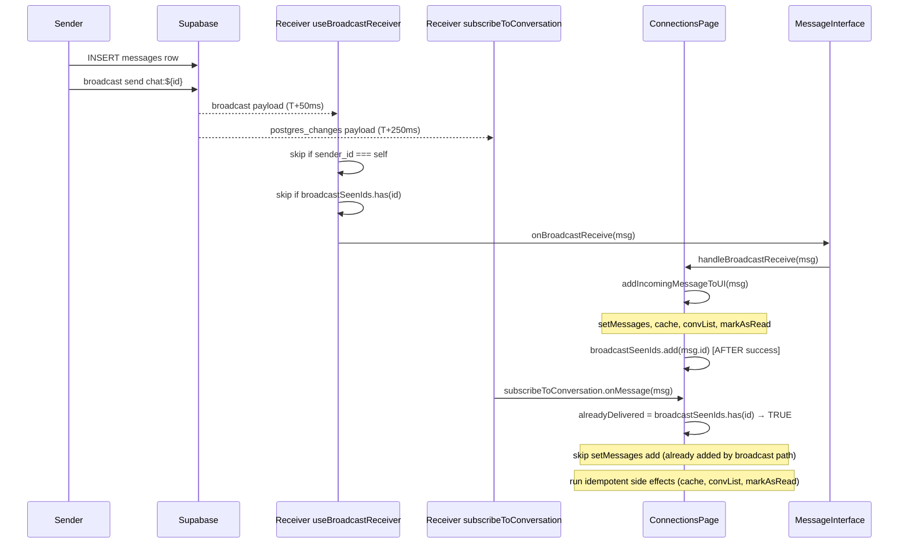
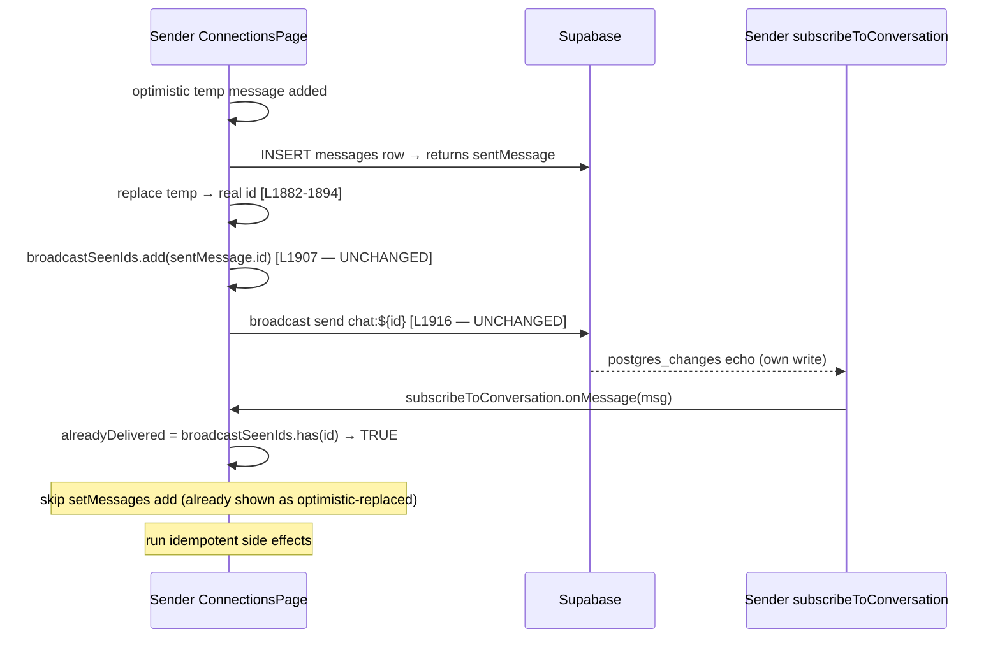

# SPEC — ORCH-0664: DM Realtime Receive Dedup Ordering

**Status:** READY FOR IMPLEMENTATION
**Investigation:** `reports/INVESTIGATION_ORCH-0663_0664_0665_CHAT_TRIPLE.md`
**Severity:** S1 (every DM receiver of every message is silently dropped from UI until close+reopen)
**Confidence:** HIGH (six-field root cause, three independent verifications)
**OTA-safe:** YES (no native changes, no migration, no edge function)
**Estimated diff:** +35/-10 LOC across 3 files

---

## §0 Architecture choice — LOCKED: Option B (move dedup INSIDE delivery)

Three options were enumerated in the dispatch. Spec writer locks **Option B**.

**Why B over A:** A and B produce nearly identical end-state code (both pass a callback
from ConnectionsPage to MessageInterface), but B is the more principled framing —
it codifies a NEW invariant `I-DEDUP-AFTER-DELIVERY` that prevents this exact class of
bug from recurring anywhere in the codebase. Same surface change; better intellectual
foundation.

**Why B over C:** C would relocate the broadcast channel subscription from MessageInterface
to ConnectionsPage. That is the right ownership long-term (eliminates HF-0664-A
load-bearing-coupling at [ConnectionsPage.tsx:1909-1912](app-mobile/src/components/ConnectionsPage.tsx#L1909-L1912))
but requires reasoning about channel re-use across two different consumers (ConnectionsPage
needs it for SEND; receiving needs it for broadcast). C is bundled too much into a single
spec. **C is filed as ORCH-0664.D-3** (broadcast ownership consolidation) — separate
follow-up after B ships and proves stable.

**Founder may override** by re-instructing forensics to choose A or C. Once spec is
locked, scope binds.

---

## §1 Scope and Non-Goals

### In scope
- Make MessageInterface's broadcast-receive handler non-no-op (call a callback into
  ConnectionsPage's add-incoming-message path).
- Move `broadcastSeenIds.add(msg.id)` from `useBroadcastReceiver.ts:51` to inside the
  ConnectionsPage handler, so it fires AFTER the UI state has been successfully mutated.
- Extract a single shared `addIncomingMessageToUI` helper from the existing
  postgres_changes `onMessage` body so both delivery paths use the same logic.
- Register new invariant `I-DEDUP-AFTER-DELIVERY`.
- Update protective comments at the three sites that document the old (broken) intent.
- One CI gate (grep) preventing the literal pre-emptive-add pattern from re-appearing.

### Non-goals (explicit)
- **0664.D-1** — `useMessages.ts` deprecated cleanup (separate ORCH).
- **0664.D-2** — realtime reconnect-on-foreground (separate ORCH; HF-0664-C).
- **0664.D-3** — broadcast ownership consolidation Option C (separate ORCH; HF-0664-A).
- **ORCH-0663** — discussion quote ribbon (separate spec already written).
- **ORCH-0665** — chat delete soft-hide (separate spec already written).
- Collab session chat — DMs are friend-only; collab session messages route through
  `BoardDiscussionTab` + `realtimeService.subscribeToBoardSession`, NOT through
  `subscribeToConversation` or `useBroadcastReceiver`. Verified via grep — no shared code.
- Read receipts realtime — UPDATE handler at [ConnectionsPage.tsx:1601-1617](app-mobile/src/components/ConnectionsPage.tsx#L1601-L1617)
  is unaffected (different event, different field, different dedup story).

### Assumptions
- `supabase.channel(name)` returns the same instance for the same name within a session
  (Supabase Realtime contract; relied on by SEND path at L1915 today, unchanged).
- The broadcast envelope shape (`payload.payload as DirectMessage`) is stable. No type
  improvement in this spec; typed fixup deferred.
- No RLS changes required. No publication change required (already verified `messages`
  is in `supabase_realtime` publication, see investigation).

---

## §2 Five-truth-layer table (acknowledged, not re-litigated)

| Layer | State | Spec impact |
|-------|-------|-------------|
| Docs | No prior spec covering broadcast/CDC dedup architecture. THIS SPEC becomes the doc. | Spec-as-doc. |
| Schema | Healthy: `messages` table, RLS for participants, FK + indexes correct. `messages` IS in `supabase_realtime` publication ([20260310000002:59](supabase/migrations/20260310000002_create_user_push_tokens_and_realtime.sql#L59)). | NO CHANGE. |
| Code | Receive-path dedup ordering broken (pre-emptive seen-set add + no-op delegate + CDC skip). | THIS SPEC's surface. |
| Runtime | Broadcast delivers, CDC delivers, BOTH bypass UI state. Side effects (cache, conversation list, mark-as-read) DO run. | Will be fixed indirectly by CODE change. |
| Data | DB writes correctly; data is healthy. UI reads stale state until close+reopen reload. | NO CHANGE. |

**Code is the sole change surface.** No DB. No edge fn. No native.

---

## §3 Architecture (post-fix)

### Sequence — Receiver side, broadcast first then CDC (typical)



### Sequence — Receiver side, CDC arrives first (broadcast missed / channel disconnect)

```mermaid
sequenceDiagram
    participant Sender
    participant Supabase
    participant ReceiverCDCHook as Receiver subscribeToConversation
    participant ConnectionsPage
    participant ReceiverBroadcastHook as Receiver useBroadcastReceiver

    Sender->>Supabase: INSERT messages row
    Sender--xSupabase: broadcast send (channel disconnected — failure non-fatal)
    Supabase-->>ReceiverCDCHook: postgres_changes payload (T+250ms)

    ReceiverCDCHook->>ConnectionsPage: subscribeToConversation.onMessage(msg)
    ConnectionsPage->>ConnectionsPage: alreadyDelivered = broadcastSeenIds.has(id) → FALSE
    ConnectionsPage->>ConnectionsPage: addIncomingMessageToUI(msg)
    Note over ConnectionsPage: setMessages, cache, convList, markAsRead
    ConnectionsPage->>ConnectionsPage: broadcastSeenIds.add(msg.id) [AFTER success]

    Note right of ReceiverBroadcastHook: broadcast channel reconnects later;<br/>future broadcasts fire normally
```

### Sequence — Sender side own-write (regression preserve)



**Crucial property:** sender's L1907 explicit pre-emptive add was correct because the
sender ALREADY has the message in their UI state (via optimistic-replace). Without the
seen-set add, postgres_changes echo would re-add the sender's own message. **L1907 stays
exactly as is.** Only the RECEIVER-side pre-emptive add (in `useBroadcastReceiver`) is
the bug.

---

## §4 Layer-by-Layer Change List

### Layer: Hook (`useBroadcastReceiver.ts`)

**File:** [app-mobile/src/hooks/useBroadcastReceiver.ts](app-mobile/src/hooks/useBroadcastReceiver.ts)

**Change:** Remove the pre-emptive `broadcastSeenIds.current.add(msg.id);` line. The
defensive `if (broadcastSeenIds.current.has(msg.id)) return;` check stays — it now defends
against duplicate broadcast events for the same id (Supabase doesn't typically emit
duplicates, but the check is cheap).

**Updated body of the broadcast event handler (lines 41-53):**

```typescript
.on('broadcast', { event: 'new_message' }, (payload) => {
  const msg = payload.payload as DirectMessage;

  // Skip own messages (already shown as optimistic).
  if (msg.sender_id === currentUserId) return;

  // Defensive double-fire dedup ONLY — the seen-set's authoritative population
  // happens INSIDE the delegate (ConnectionsPage's addIncomingMessageToUI),
  // AFTER the message is added to UI state. This invariant
  // (I-DEDUP-AFTER-DELIVERY) is what prevents the postgres_changes backup
  // path from being silently skipped.
  if (broadcastSeenIds.current.has(msg.id)) return;

  // Deliver — delegate is responsible for both UI state mutation AND seen-set add.
  onBroadcastMessageRef.current(msg);
})
```

**Net change:** REMOVE one line (`broadcastSeenIds.current.add(msg.id);` at L51).
ADD a multi-line protective comment.

**No props/signature change.** `UseBroadcastReceiverOptions` interface unchanged.

### Layer: Component — MessageInterface

**File:** [app-mobile/src/components/MessageInterface.tsx](app-mobile/src/components/MessageInterface.tsx)

**Change 1 — Props interface:** add new required prop.

```typescript
interface MessageInterfaceProps {
  // … existing props unchanged
  conversationId: string | null;
  currentUserId: string | null;
  currentUserName: string;
  broadcastSeenIds: React.MutableRefObject<Set<string>>;
  /**
   * ORCH-0664: Called when a broadcast delivers a new message from another user.
   * Owner: ConnectionsPage. Required (not optional). The handler MUST add the
   * message to UI state and mark `broadcastSeenIds.current.add(msg.id)` as a
   * single coupled operation — partial implementations re-introduce the bug class.
   */
  onBroadcastReceive: (msg: DirectMessage) => void;
  // … rest unchanged
}
```

**Change 2 — replace no-op handler at L235-241:**

```typescript
// ── Broadcast receiver (receive-only) ─────────────────────
// IMPORTANT: This hook subscribes to the `chat:{conversationId}` broadcast channel.
// ConnectionsPage.handleSendMessage depends on this channel being subscribed
// so that supabase.channel() returns the existing subscribed channel for sending.
// Do NOT remove this hook without moving the channel subscription to ConnectionsPage
// (tracked as ORCH-0664.D-3 / HF-0664-A).
useBroadcastReceiver({
  conversationId,
  currentUserId,
  broadcastSeenIds,
  onBroadcastMessage: onBroadcastReceive,
});
```

**Net change:** delete the `handleBroadcastMessage = useCallback` no-op block at
L235-241. Pass `onBroadcastReceive` directly. Update Props interface and the existing
header comment block to point at the new owner. Remove the misleading
"ConnectionsPage owns all message state — broadcast messages are deduplicated there"
comment (it described the broken intent).

### Layer: Component — ConnectionsPage

**File:** [app-mobile/src/components/ConnectionsPage.tsx](app-mobile/src/components/ConnectionsPage.tsx)

**Change 1 — Extract shared helper.** A new function above
`setupRealtimeSubscription` (which is itself between L1500 and L1620):

```typescript
/**
 * ORCH-0664: Single owner for incoming-message UI state mutation.
 * Both the broadcast receiver (chat:${id}) and the postgres_changes subscriber
 * (conversation:${id}) call this. The seen-set add is INSIDE this helper —
 * after a successful UI mutation — to satisfy I-DEDUP-AFTER-DELIVERY.
 *
 * If `broadcastSeenIds.current.has(newMessage.id)` is already true, this means
 * the OTHER delivery path won the race — we skip the visible-messages add but
 * still run the idempotent side effects (cache, conversation list, mark-as-read).
 */
const addIncomingMessageToUI = useCallback(
  (newMessage: DirectMessage, conversationId: string, userId: string) => {
    const alreadyDelivered = broadcastSeenIds.current.has(newMessage.id);

    if (!alreadyDelivered) {
      const transformedMsg = transformMessage(newMessage, userId);

      setMessages((prev) => {
        const exists = prev.some((msg) => msg.id === transformedMsg.id);
        if (exists) return prev;

        const optimisticIndex = prev.findIndex(
          (msg) =>
            msg.id.startsWith("temp-") &&
            msg.senderId === transformedMsg.senderId &&
            msg.content === transformedMsg.content &&
            Math.abs(
              new Date(msg.timestamp).getTime() -
                new Date(transformedMsg.timestamp).getTime()
            ) < 5000
        );

        if (optimisticIndex !== -1) {
          const updated = [...prev];
          updated[optimisticIndex] = transformedMsg;
          return updated;
        }

        return [...prev, transformedMsg];
      });

      // Couple the seen-set add to a successful UI mutation.
      // I-DEDUP-AFTER-DELIVERY: never populate the seen-set without
      // a corresponding visible-messages addition.
      broadcastSeenIds.current.add(newMessage.id);
    }

    // Cache update ALWAYS runs (idempotent — uses same exists/optimistic checks).
    const transformedForCache = transformMessage(newMessage, userId);
    setMessagesCache((prev) => {
      const existing = prev[conversationId] || [];
      const exists = existing.some((msg) => msg.id === transformedForCache.id);
      if (exists) return prev;

      const optimisticIndex = existing.findIndex(
        (msg) =>
          msg.id.startsWith("temp-") &&
          msg.senderId === transformedForCache.senderId &&
          msg.content === transformedForCache.content &&
          Math.abs(
            new Date(msg.timestamp).getTime() -
              new Date(transformedForCache.timestamp).getTime()
          ) < 5000
      );

      if (optimisticIndex !== -1) {
        const updated = [...existing];
        updated[optimisticIndex] = transformedForCache;
        return { ...prev, [conversationId]: updated };
      }

      return { ...prev, [conversationId]: [...existing, transformedForCache] };
    });

    // Conversation list update ALWAYS runs.
    setConversations((prev) =>
      prev.map((conv): Conversation => {
        if (conv.id === conversationId) {
          return {
            ...conv,
            last_message: newMessage as unknown as ConvMessage,
          };
        }
        return conv;
      })
    );

    // Auto-mark as read for incoming messages (chat is open by precondition).
    if (newMessage.sender_id !== userId) {
      messagingService.markAsRead([newMessage.id], userId).catch(console.error);
    }
  },
  [transformMessage]
);
```

**Change 2 — replace the body of `setupRealtimeSubscription.onMessage` (currently L1512-1595)
with a single call:**

```typescript
onMessage: (newMessage: DirectMessage) => {
  addIncomingMessageToUI(newMessage, conversationId, userId);
},
```

`onMessageUpdated` at L1601-1617 stays unchanged (read-receipt UPDATE path; not affected).

**Change 3 — define the broadcast-receive handler:**

```typescript
const handleBroadcastReceive = useCallback(
  (msg: DirectMessage) => {
    if (!currentConversationId || !user?.id) return;
    addIncomingMessageToUI(msg, currentConversationId, user.id);
  },
  [currentConversationId, user?.id, addIncomingMessageToUI]
);
```

Place this near `setupRealtimeSubscription` definition (L1500 area).

**Change 4 — pass `onBroadcastReceive={handleBroadcastReceive}` to MessageInterface
in the JSX render at L2199 area:**

```jsx
<MessageInterface
  // … existing props
  conversationId={currentConversationId}
  currentUserId={user?.id || null}
  currentUserName={currentUserDisplayName}
  broadcastSeenIds={broadcastSeenIds}
  onBroadcastReceive={handleBroadcastReceive}
  // … rest
/>
```

**Net change:** ~80 lines extracted into helper (no logic change to that body —
straight extraction from existing); new ~6-line `handleBroadcastReceive` callback;
1 prop added to the JSX. The original onMessage body shrinks from ~80 lines to 1 line.

### Layer: Service / Hook / DB / Edge fn / Realtime publication

**NO CHANGE** at any of these layers. The investigation confirmed all are healthy.

---

## §5 Success Criteria (numbered, observable, testable)

| # | Criterion | Layer |
|---|-----------|-------|
| **SC-1** | Receiver's `messages` array gains the new message within 1s of sender's send (typical broadcast latency <500ms; CDC adds 200-500ms). Verified by two-device live-fire with stopwatch. | Component + Hook |
| **SC-2** | When the broadcast channel is unavailable (simulated by force-disconnecting `chat:${id}` on receiver), postgres_changes path delivers within 2s. UI updates without manual refresh. | Component + Hook |
| **SC-3** | When BOTH broadcast and CDC arrive for the same message id, receiver shows it EXACTLY ONCE — no duplicate bubble. | Component |
| **SC-4** | Sender's optimistic-replace path still works: sender sees their own message instantly, the postgres_changes echo of their own write does NOT re-add. | Component (regression) |
| **SC-5** | Mark-as-read still fires for incoming messages on the receiver's open thread (`messagingService.markAsRead([msg.id], userId)` called exactly once per arrival). | Service (regression) |
| **SC-6** | Chat-list "last message" preview still updates when a new message arrives in any conversation (open or not). | Component (regression) |
| **SC-7** | Conversation list `unread_count` does NOT increment for the conversation that is currently open (the chat is visible — no badge to inflate). For other conversations, full unread flow remains unchanged (out of scope for this fix; existing behavior preserved). | Component (regression) |
| **SC-8** | After this fix, `broadcastSeenIds` Set still gets cleared on `handleBackFromMessage` ([ConnectionsPage.tsx:1637](app-mobile/src/components/ConnectionsPage.tsx#L1637) — unchanged). No memory leak between conversations. | Component (regression) |
| **SC-9** | The grep CI gate (§9) catches any future addition of `broadcastSeenIds.current.add(` inside `useBroadcastReceiver.ts` — exit code 1 with descriptive error. | CI |
| **SC-10** | TypeScript `tsc --noEmit` exits 0 in `app-mobile/`. New `onBroadcastReceive` prop typed as `(msg: DirectMessage) => void`. No `any`. No `as unknown`. | CI |
| **SC-11** | Two-device matrix (T-09 below) all PASS. | Live-fire |

---

## §6 Test Cases

| Test | Scenario | Input | Expected | Layer |
|------|----------|-------|----------|-------|
| T-01 | Receiver gets msg via broadcast | Sender sends "hi"; both devices online | "hi" appears on receiver in <1s; no duplicate; mark-as-read fires once | Full stack |
| T-02 | Receiver gets msg via CDC only | Receiver disconnects broadcast (force `removeChannel(chat:${id})`); sender sends "hi" | "hi" appears via postgres_changes within 2s; mark-as-read fires once | Hook + Component |
| T-03 | Both paths deliver same id | Default conditions; sender sends "hi" | "hi" appears exactly once on receiver; broadcastSeenIds gains the id once | Component |
| T-04 | Sender own-message echo | Sender sends "hi"; CDC echoes own write | Sender sees "hi" once (optimistic-replaced), no duplicate from CDC echo | Component (regression) |
| T-05 | Network blip during send | Kill network 1s into send; restore after 5s | Sender's message marked failed, retry available; receiver gets it after retry; no duplicates | Full stack |
| T-06 | Two convos open in tabs | Receiver has Conv A open; sender sends to Conv B | Conv B's "last message" preview updates in chat-list; Conv B unread_count increments; Conv A unaffected | Component |
| T-07 | broadcast late-arrives after CDC | Inject 5s artificial delay on broadcast; CDC arrives first | UI updates via CDC at T+0.5s; broadcast arrival at T+5s sees seen-set TRUE → no double-add | Hook |
| T-08 | Self-multi-device | User logged in on phone + tablet; sends from phone | Tablet (also a "receiver" of own send) — wait: own-message check filters, no UI add expected on tablet (since `msg.sender_id === currentUserId` early-returns at useBroadcastReceiver.ts:45). Tablet's own postgres_changes echo also skipped via own broadcastSeenIds (handled by sender-side L1907 add). | Component (regression) |
| T-09 | Two-device live-fire matrix | Devices A + B both online; A sends 5 messages in sequence; B sends 3; A sends 2 more | All messages render in correct order on both sides within 1s; no duplicates; mark-as-read fires for inbound only; chat-list previews update | Live-fire |
| T-10 | Channel reconnection (after 5min background) | Receiver backgrounds 5min; sender sends 3 messages during background; receiver foregrounds | On foreground: receiver fetches missed via `getMessages` (existing reconnection path at [ConnectionsPage.tsx:1480-1493](app-mobile/src/components/ConnectionsPage.tsx#L1480-L1493)); thereafter realtime resumes | Component (regression) |

T-09 and T-10 are USER-OWNED live-fire (cannot be headless). T-01 to T-08 should be
runnable with mocked Supabase Realtime in a Jest harness if one exists; otherwise live-fire
on dev.

---

## §7 Invariants

### NEW invariant — register in `INVARIANT_REGISTRY.md`

**`I-DEDUP-AFTER-DELIVERY`**

> Dedup tracking sets (e.g., `broadcastSeenIds`, idempotency keys, request-id sets,
> "already-processed" caches) MUST be populated INSIDE the success path of the delivery
> they are deduping, AFTER the user-visible state has been mutated. Pre-emptive population
> (before delegation) creates a class of bug where the secondary delivery path silently
> skips because the dedup set falsely reports "already delivered" when the primary path
> was a no-op.
>
> **Enforcement:**
> - Code review checklist: any `*.add(id)` adjacent to a delegate call must come AFTER
>   the delegate, not before.
> - CI grep gate: `useBroadcastReceiver.ts` must NOT contain `broadcastSeenIds.current.add(`
>   inside the broadcast event handler. Population is the ConnectionsPage handler's
>   responsibility.
> - Pattern test: a unit test on `useBroadcastReceiver` that injects a no-op delegate and
>   asserts `broadcastSeenIds` remains empty after the broadcast event (proves the bad
>   pattern cannot return).
>
> **Exception:** Pre-emptive add is permitted IF the caller has ALREADY mutated state
> in another way (e.g., the SENDER's own L1907 add at ConnectionsPage:1907 — sender has
> already shown the message via optimistic-replace; the seen-set add is correct because
> the UI mutation is local-side, not delegate-side).

### Preserved invariants (this spec must not violate)

- **I-RLS-PARTICIPANT-GATED-MESSAGES** — RLS on `messages` SELECT is `EXISTS (...participant)`.
  This spec changes no SQL; preserved by definition.
- **Constitution #2 (One owner per truth)** — pre-fix: TWO owners of "is this message
  in the receiver's UI" (broadcast hook claims it via seen-set add; CDC handler is the
  only one who actually writes UI state but defers based on seen-set). Post-fix: ONE
  owner — `addIncomingMessageToUI` in ConnectionsPage. Both delivery paths funnel through it.
- **Constitution #3 (No silent failures)** — pre-fix: silent message-drop. Post-fix:
  message arrives via at least one path; `console.error` paths preserved on
  `messagingService.markAsRead` failure.
- **Constitution #8 (Subtract before adding)** — this spec deletes the no-op handler
  and the pre-emptive seen-set add. Net `-2` lines deleted before adding the helper.
- **I-RECEIPT-UPDATE-PATH-INTACT** — `onMessageUpdated` at L1601-1617 unchanged.

---

## §8 Implementation Order

1. **Update `useBroadcastReceiver.ts`** — remove L51 pre-emptive add; add protective
   comment block.
2. **Add `addIncomingMessageToUI` helper in `ConnectionsPage.tsx`** — extracted body
   from current `setupRealtimeSubscription.onMessage` (L1516-1594), with the
   `broadcastSeenIds.current.add(newMessage.id)` line MOVED to AFTER `setMessages`
   inside the `if (!alreadyDelivered)` block.
3. **Replace `setupRealtimeSubscription.onMessage` body** with a single call to
   `addIncomingMessageToUI`.
4. **Add `handleBroadcastReceive` callback in `ConnectionsPage.tsx`** — calls
   `addIncomingMessageToUI` with current conversation/user.
5. **Update `MessageInterface.tsx`:** add `onBroadcastReceive` prop to interface
   (required), delete the no-op `handleBroadcastMessage`, pass `onBroadcastReceive`
   directly to `useBroadcastReceiver`. Update header comment block.
6. **Pass `onBroadcastReceive={handleBroadcastReceive}` in the JSX render of
   MessageInterface at ConnectionsPage L2199 area.**
7. **Add CI gate** to `scripts/ci-check-invariants.sh`:
   ```bash
   if grep -nE "broadcastSeenIds\.current\.add\(" app-mobile/src/hooks/useBroadcastReceiver.ts; then
     echo "FAIL — I-DEDUP-AFTER-DELIVERY: broadcastSeenIds must NOT be populated inside useBroadcastReceiver. Population belongs in the delegate (ConnectionsPage.addIncomingMessageToUI)."
     exit 1
   fi
   ```
8. **Register `I-DEDUP-AFTER-DELIVERY`** in `Mingla_Artifacts/INVARIANT_REGISTRY.md`
   with the formal definition from §7.
9. **Run `tsc --noEmit`** in `app-mobile/` — exit 0 required.
10. **Run `scripts/ci-check-invariants.sh`** — exit 0 required.
11. **Negative-control reproduction:** temporarily reintroduce
    `broadcastSeenIds.current.add(msg.id)` to useBroadcastReceiver.ts — confirm CI gate
    exits 1; revert; confirm gate exits 0.
12. **User device smoke** — T-09 two-device live-fire matrix.

---

## §9 Regression Prevention

### Protective comment (required at three sites)

1. `useBroadcastReceiver.ts` — multi-line block above the broadcast event handler
   (already in §4 Change for the file).
2. `ConnectionsPage.tsx` — JSDoc above `addIncomingMessageToUI` referencing
   `I-DEDUP-AFTER-DELIVERY` and ORCH-0664.
3. `MessageInterface.tsx` — updated header comment block above `useBroadcastReceiver`
   call referencing the prop owner.

### CI gate

Per §8 step 7. The existing `scripts/ci-check-invariants.sh` is the right home. Pattern
matches the gate added by ORCH-0646 (admin frontend ai_approved scope addition) and
ORCH-0649 (NO-FABRICATED-DISPLAY-N/A) — proven harness.

### Negative-control test

Per §8 step 11. Run before merge. The implementation report MUST include screenshots
or terminal output of (1) gate exits 1 with violation, (2) gate exits 0 with clean code.
This was the canonical proof pattern used by ORCH-0646 cycle 1 and ORCH-0649.

### Documentation lock-in

Add entry to `Mingla_Artifacts/ROOT_CAUSE_REGISTER.md`:
> RC-0664 — DM realtime receive silently drops messages when broadcast handler is no-op
> AND CDC handler defers based on a seen-set populated pre-emptively by the broadcast
> handler. Fix established `I-DEDUP-AFTER-DELIVERY`. Recurrence vector: any future code
> using a "seen-set" or "idempotency cache" must populate it AFTER the handled work,
> not before delegation.

---

## §10 Solo / Collab Parity Check

- **Friend DM (this spec's surface):** `subscribeToConversation` + `useBroadcastReceiver`
  + `messages` table + `chat:${conversationId}` broadcast. ALL the affected code paths.
- **Collab session DM (out of scope):** `realtimeService.subscribeToBoardSession` +
  `board_messages` table + `board:${sessionId}` channel via realtimeService. **Different
  channel name. Different table. Different hook. Different handler shape.** Confirmed
  by grep — zero shared code with the broken DM path.
- **Card-level discussions (out of scope):** `board_card_messages` — also via
  realtimeService. Same isolation.

**No parity bundling required. ORCH-0664 is friend-DM-only.**

---

## §11 Risk Analysis

| Risk | Likelihood | Mitigation |
|------|-----------|-----------|
| Helper extraction introduces regression in side-effect ordering (cache-then-conv-list-then-mark-read) | LOW | Pure extraction with line-by-line copy from current onMessage body. T-04, T-05, T-06 explicitly verify regression. |
| `transformMessage` referenced inside `useCallback` dep array races with `markConversationAsRead` | LOW | `transformMessage` is itself a `useCallback` from current code at L1485 area. Existing pattern. No new races. |
| Channel re-use semantics change unexpectedly | NIL | Spec touches no `supabase.channel(...)` calls. Send path at L1909-1923 unchanged. |
| TypeScript types for `payload.payload as DirectMessage` exposed by no-op removal | NIL | Cast was already there. Unchanged. |
| Double-fire on broadcast (Supabase Realtime emits same broadcast twice somehow) | LOW | Defensive `if (broadcastSeenIds.current.has(msg.id)) return;` at L48 stays. Now correctly defends because seen-set IS populated by the delegate's first run. |
| Sender-on-multi-device — own broadcast received on second device | NIL | useBroadcastReceiver.ts:45 `if (msg.sender_id === currentUserId) return;` early-exits before the seen-set check. T-08 verifies. |

---

## §12 Five-Layer Compliance Recap

| Layer | Pre-fix | Post-fix |
|-------|---------|----------|
| Docs | None | This spec is the doc. ROOT_CAUSE_REGISTER + INVARIANT_REGISTRY updated. |
| Schema | Healthy | Unchanged. |
| Code | Pre-emptive seen-set add → no-op delegate → CDC skip. Two owners of "delivered" claim. | Single `addIncomingMessageToUI` helper. Seen-set populated AFTER UI mutation. Two delivery paths idempotently funnel through one helper. |
| Runtime | Broadcast and CDC both deliver; UI silently drops both. | Broadcast OR CDC (whichever wins) populates UI; other path becomes idempotent no-op via seen-set. |
| Data | Unchanged | Unchanged. |

---

## §13 Commit Message Draft

```
fix(chat): ORCH-0664 DM realtime receive — couple seen-set add to UI mutation

Receiver-side broadcast handler was a deliberate no-op that pre-marked the
message id in broadcastSeenIds; postgres_changes then saw the seen flag and
skipped the setMessages add. Result: every DM message silently dropped from
UI until close+reopen.

Fix: extract addIncomingMessageToUI helper in ConnectionsPage. Both the
broadcast hook (via new onBroadcastReceive prop on MessageInterface) and
postgres_changes onMessage funnel through it. Seen-set is populated INSIDE
the helper, AFTER setMessages has run. Establishes invariant
I-DEDUP-AFTER-DELIVERY (registered) + CI gate to prevent recurrence.

No DB / native / edge fn changes — OTA-safe both platforms.

ORCH-0664 closes.
Investigation: reports/INVESTIGATION_ORCH-0663_0664_0665_CHAT_TRIPLE.md
Spec: specs/SPEC_ORCH-0664_DM_REALTIME_DEDUP.md
```

---

## §14 Implementation Constraints (binding)

- TypeScript strict; no `any`, no `as any`, no `as unknown`. Existing
  `payload.payload as DirectMessage` cast at useBroadcastReceiver.ts:42 is acceptable
  (Supabase Realtime payloads are intentionally generic — narrowing-by-cast is the
  established pattern across the codebase).
- React Query — no new query keys. No factory changes. The `messagingService` calls
  are already non-React-Query (per memory: ConnectionsPage uses direct Supabase calls,
  not React Query).
- Zustand — no client state changes. `messages` and `broadcastSeenIds` stay in
  ConnectionsPage's local React state / refs.
- StyleSheet — no UI styling change.
- i18n — no copy change.
- Solo/collab parity — N/A (verified §10).

---

## §15 Acceptance Checklist (orchestrator REVIEW gate)

- [ ] §0 architecture choice matches investigation recommendation (Option B). — YES.
- [ ] §1 scope/non-goals explicitly enumerate the four out-of-scope discoveries. — YES.
- [ ] §2 five-layer table acknowledges Schema/Runtime/Data healthy. — YES.
- [ ] §3 sequence diagrams cover: typical broadcast-first, CDC-first-only, sender-own-write. — YES.
- [ ] §4 layer changes give exact file paths, exact lines, exact prop signatures. — YES.
- [ ] §5 success criteria are observable, testable, unambiguous. 11 criteria covering full surface + regression + CI. — YES.
- [ ] §6 test matrix has happy + error + dedup-collision + sender-echo + multi-device + reconnection. 10 cases. — YES.
- [ ] §7 invariant `I-DEDUP-AFTER-DELIVERY` formally registered with enforcement. — YES.
- [ ] §8 implementation order sequenced (hook → helper → wiring → CI gate → invariant register → smoke). — YES.
- [ ] §9 regression prevention has comment + CI gate + negative-control + doc lock-in. — YES.
- [ ] §10 solo/collab parity proven N/A by grep evidence. — YES.
- [ ] §11 risk analysis has 6 enumerated rows with mitigations. — YES.
- [ ] §13 commit message draft included. — YES.
- [ ] OTA-safe (no native, no migration, no edge fn). — YES.

**SPEC IS READY FOR IMPLEMENTATION.**
