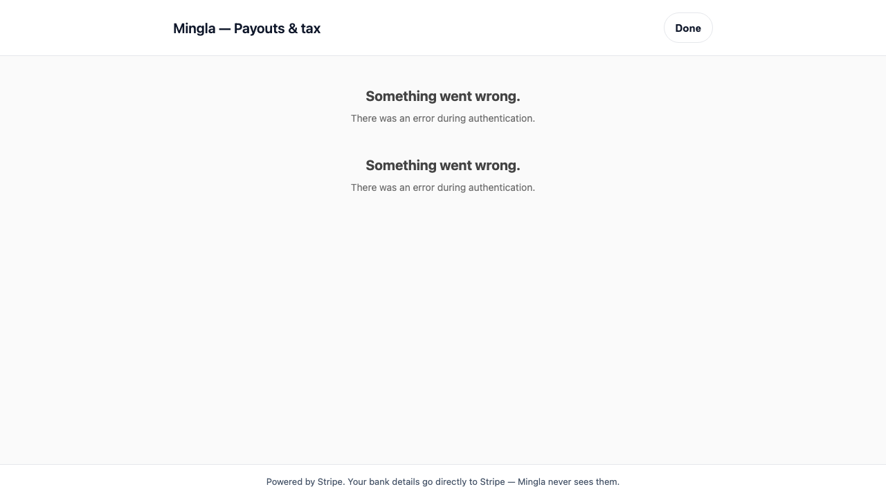

# TEST - ORCH-0954 [Embedded onboarding cutover + Stripe-managed risk]

**Tester:** Codex `tester-mingla` parity mirror  
**Date:** 2026-05-25  
**Worktree:** `~/Desktop/mingla-orchs/ORCH-0954-[embedded-onboarding-cutover]/`  
**Branch:** `ORCH-0954-embedded-onboarding-cutover`  
**Verdict:** **FAIL - SPEC §6 live-fire gate not met**

## Executive result

ORCH-0954 is still not ready for CLOSE. The prior production route blocker is resolved: both Mingla-hosted pages now return HTTP 200 on `business.usemingla.com`. The rerun exposed earlier Stripe runtime blockers instead:

1. New connected-account creation still sends `fees_collector: "account"`, and Stripe's TEST-mode Accounts v2 API rejects that enum before onboarding can begin.
2. The onboarding Account Session payload sends `collection_options` under `components.account_onboarding.features`, and Stripe's TEST-mode Account Sessions API rejects that parameter.
3. A valid TEST-mode account-management Account Session can be minted against a corrected TEST account, but the production page renders Stripe authentication errors instead of `<ConnectNotificationBanner>` / `<ConnectAccountManagement>`. Current code requires a `pk_live_` publishable key for production builds, so the production host is not usable for TEST-mode embedded-component proof without a test-key preview/staging host or an explicitly test-configured production deployment.

The route-availability issue is fixed, but Smoke A cannot create/onboard a fresh TEST brand through the deployed implementation, and Smoke B cannot be truthfully passed from production TEST-mode evidence.

## Inputs read

- `Mingla_Artifacts/tests/TEST_ORCH-0954_LIVE_FIRE.md` prior FAIL
- `Mingla_Artifacts/specs/SPEC_ORCH-0954_EMBEDDED_ONBOARDING_CUTOVER.md` §6
- `Mingla_Artifacts/reports/IMPLEMENTATION_ORCH-0954_EMBEDDED_ONBOARDING_CUTOVER.md`
- `/Users/sethogieva/Desktop/mingla-main/COMMS_LEDGER.md`
- Production merge commit code at `b2866f0e`

## Comms ledger

Read before work per AGENTS.md. `COMMS-0002` is `WARN` to `ALL`; I acknowledged it as `tester+codex (ORCH-0954)` and factored it in as a CI/process warning only. `COMMS-0001` remains the ORCH-0955 tax-dashboard scope guard; this test did not touch `supabase/functions/brand-stripe-tax-dashboard-link/`.

## Live deploy/readiness evidence

### Edge functions

Command:

```bash
/Users/sethogieva/bin/supabase functions list --project-ref gqnoajqerqhnvulmnyvv | rg 'brand-stripe-onboard|brand-stripe-account-session|stripe-webhook|NAME'
```

Result:

```text
brand-stripe-onboard          ACTIVE  VERSION 95   UPDATED_AT 2026-05-25 03:57:42 UTC
brand-stripe-account-session  ACTIVE  VERSION 3    UPDATED_AT 2026-05-25 03:57:36 UTC
stripe-webhook                ACTIVE  VERSION 134  UPDATED_AT 2026-05-25 03:59:57 UTC
```

### Business web routes

Command:

```bash
curl -sS -D - -o /tmp/orch0954_onboarding_route.html 'https://business.usemingla.com/connect-onboarding?session=acs_test_placeholder&brand_id=00000000-0000-0000-0000-000000000000&return_to=mingla-business%3A%2F%2Fonboarding-complete'
```

Result: HTTP 200, Vercel, `content-length: 49768`.

Command:

```bash
curl -sS -D - -o /tmp/orch0954_management_route.html 'https://business.usemingla.com/connect-account-management?session=acs_test_placeholder&brand_id=00000000-0000-0000-0000-000000000000&return_to=mingla-business%3A%2F%2Fonboarding-complete'
```

Result: HTTP 200, Vercel, `content-length: 49750`.

## SPEC §6 live-fire smokes

| Smoke | Required outcome | Actual result | Verdict |
|---|---|---|---|
| Smoke A - onboarding | Fresh TEST brand opens `business.usemingla.com/connect-onboarding`, embedded onboarding renders, KYC completes, onExit deep-links back, status refresh updates. | Blocked before UI. Stripe TEST-mode Accounts v2 rejects the deployed controller payload because `fees_collector: "account"` is not a valid enum value. A second Stripe TEST call also proved the next onboarding Account Session payload would reject `components[account_onboarding][features][collection_options]` as an unknown parameter. | FAIL |
| Smoke B - account management | Same TEST brand opens `business.usemingla.com/connect-account-management`, notification banner + account management render, bank-account edit + payout schedule + tax-registration view can be inspected in TEST mode. | Route is reachable. I minted a valid TEST-mode account-management session against a corrected TEST account and loaded the production page, but the page rendered two Stripe authentication errors instead of the required components. I did not use live keys. Bank edit, payout schedule, tax registration, and DB diff remain unverified. | FAIL |

## Finding 1 - P1 BLOCKER - New account creation uses invalid Stripe enum

Production merge commit `b2866f0e` and the ORCH worktree both contain:

- `supabase/functions/_shared/stripeBlueprintClient.ts:14-22`: `STRIPE_MANAGED_RISK_CONTROLLER` sets `losses_collector: "stripe"`, `fees_collector: "account"`, `dashboard: "none"`.
- `supabase/functions/_shared/stripeBlueprintClient.ts:189`: `createRecipientAccount()` spreads that controller object into the `/v2/core/accounts` body.

Stripe TEST-mode proof:

```bash
stripe v2 core accounts create --confirm --stripe-version=2026-04-22.preview \
  --display-name=ORCH0954-live-fire \
  --contact-email=sethogieva+orch0954@usemingla.com \
  --dashboard=none \
  --defaults.responsibilities.losses-collector=stripe \
  --defaults.responsibilities.fees-collector=account \
  --configuration.recipient.capabilities.stripe-balance.stripe-transfers.requested=true \
  --configuration.merchant.capabilities.card-payments.requested=true \
  --identity.country=US
```

Result:

```text
invalid_fields: defaults.responsibilities.fees_collector:
Unrecognized enum value 'account', valid values are:
application, application_custom, application_express, stripe.
```

Control proof in TEST mode:

```bash
stripe v2 core accounts create --confirm --stripe-version=2026-04-22.preview \
  --display-name=ORCH0954-live-fire-stripe-fees \
  --contact-email=sethogieva+orch0954@usemingla.com \
  --dashboard=none \
  --defaults.responsibilities.losses-collector=stripe \
  --defaults.responsibilities.fees-collector=stripe \
  --configuration.recipient.capabilities.stripe-balance.stripe-transfers.requested=true \
  --configuration.merchant.capabilities.card-payments.requested=true \
  --identity.country=US
```

Result: `acct_1TapllPjlZjpOVAs` created with `livemode:false`, `dashboard:"none"`, then closed after evidence capture. This proves the failure is the `account` enum, not the account-create route or TEST-mode access.

**Impact:** A fresh brand's "Set up payments" path will fail before `connect-onboarding` can render. This is a core SPEC §6 Smoke A failure.

## Finding 2 - P1 BLOCKER - Onboarding Account Session payload is rejected

Production code builds the onboarding session components with `collection_options` nested under `features`:

- `supabase/functions/brand-stripe-onboard/index.ts:682-695`
- `supabase/functions/brand-stripe-account-session/index.ts:81-92` for the optional onboarding surface

Stripe TEST-mode proof against the corrected TEST account:

```bash
stripe account_sessions create --confirm --stripe-version=2025-04-30.basil \
  --account=acct_1TapllPjlZjpOVAs \
  -d 'components[account_onboarding][enabled]=true' \
  -d 'components[account_onboarding][features][external_account_collection]=true' \
  -d 'components[account_onboarding][features][collection_options][fields]=eventually_due' \
  -d 'components[account_onboarding][features][collection_options][future_requirements]=include'
```

Result:

```text
parameter_unknown:
Received unknown parameter: components[account_onboarding][features][collection_options]
```

I also tried `components[account_onboarding][collection_options]`; Stripe rejected that as an unknown parameter too. The React component can receive `collectionOptions`, but the Account Session create call cannot use the payload shape currently in edge code.

**Impact:** Even after fixing Finding 1, onboarding would still fail at Account Session creation unless the server-side `components.account_onboarding` payload is corrected.

## Finding 3 - P1 BLOCKER - Production host cannot render TEST account-management session

I minted a valid TEST-mode account-management Account Session against the corrected TEST account:

```bash
stripe account_sessions create --confirm --stripe-version=2025-04-30.basil \
  --account=acct_1TapllPjlZjpOVAs \
  -d 'components[account_management][enabled]=true' \
  -d 'components[account_management][features][external_account_collection]=true' \
  -d 'components[account_management][features][disable_stripe_user_authentication]=false' \
  -d 'components[notification_banner][enabled]=true' \
  -d 'components[notification_banner][features][external_account_collection]=true'
```

Result: PASS, Account Session returned `livemode:false`, `components.account_management.enabled=true`, and `components.notification_banner.enabled=true`.

I then loaded the production page with that TEST Account Session using Playwright:

```bash
npx playwright screenshot --wait-for-timeout=7000 \
  'https://business.usemingla.com/connect-account-management?session=<masked_TEST_account_session>&brand_id=00000000-0000-0000-0000-000000000000&return_to=mingla-business%3A%2F%2Fonboarding-complete' \
  Mingla_Artifacts/tests/evidence/orch-0954-account-management-cli-session.png
```

Screenshot:



Visible result: the page shell renders, but both Stripe embedded components show `Something went wrong. There was an error during authentication.`

Likely cause from source: `mingla-business/app.config.ts:88-94` requires `EXPO_PUBLIC_STRIPE_PUBLISHABLE_KEY` to start with `pk_live_` for production builds, while the session I minted was explicitly TEST mode. I did not attempt any live-mode Account Session because the dispatch forbids live keys.

**Impact:** The required TEST-mode Smoke B cannot pass against the production host as currently configured. A safe retest needs either a production-equivalent preview/staging host built with the TEST publishable key or a documented temporary TEST-key production deploy. Do not use live keys for this gate.

## Previously failed route blocker - resolved

The prior FAIL said `/connect-account-management` returned Vercel 404. That is now fixed. Both scoped routes return HTTP 200 and serve the expected Vercel-hosted web app.

## What was verified

- Production route availability is fixed for both `/connect-onboarding` and `/connect-account-management`.
- Deployed edge versions are newer than the dispatch baseline: onboard v95, account-session v3, webhook v134.
- Production merge commit `b2866f0e` still contains `fees_collector: "account"` in the account-create payload.
- Stripe TEST-mode API rejects `fees_collector: "account"` for Accounts v2 create.
- Stripe TEST-mode API accepts `fees_collector: "stripe"` with `losses_collector: "stripe"` and `dashboard: "none"`.
- Stripe TEST-mode API rejects the current onboarding Account Session `collection_options` payload shape.
- Stripe TEST-mode API accepts account-management + notification-banner Account Session creation.
- Production account-management page fails to authenticate that TEST account-management session instead of rendering the required embedded components.

## What remains unverified

- Fresh TEST brand creation through the authenticated mingla-business app.
- `brand-stripe-onboard` production invocation with a real brand JWT, because the Stripe-side payload already fails independently.
- `<ConnectAccountOnboarding>` rendering on production with a valid TEST Account Session.
- KYC completion in embedded onboarding.
- `onExit` deep-link back to `mingla-business://onboarding-complete`.
- `useBrandStripeStatus` refresh to active or pending state.
- `<ConnectNotificationBanner>` and `<ConnectAccountManagement>` successful rendering on the production host.
- Bank-account edit, payout schedule change, tax-registration view, and DB diff.

## Required rework

1. Correct the Accounts v2 controller payload so Stripe-managed risk uses Stripe's accepted enum values. Current TEST-mode evidence says `fees_collector` must not be `"account"`.
2. Remove or relocate unsupported server-side Account Session `collection_options`; keep `collectionOptions` on the React embedded component where supported.
3. Define the TEST-mode live-fire host/key strategy. If SPEC §6 must run on `business.usemingla.com`, production web cannot require `pk_live_` while the test uses TEST-mode Account Sessions.
4. Add regression coverage that fails on the current Stripe enum/payload mismatch, not only mocked source-shape assertions.
5. Rerun SPEC §6 end-to-end on a fresh TEST brand only after the above is fixed.

## Operator-impact callouts

- Do not CLOSE ORCH-0954.
- The current failure is earlier than the `<ConnectAccountManagement>` live-mode/demo-behavior warning. Smoke B did not reach a meaningful bank-edit/payout/tax-registration test because the production TEST session could not authenticate.
- Because zero live brands exist, the operator's low-cost choices are still open: revert PR #204 from main, or dispatch bounded rework for the Stripe payload/key strategy.
- Do not touch `brand-stripe-tax-dashboard-link/`; ORCH-0955 still owns the tax-dashboard rewrite per COMMS-0001.
